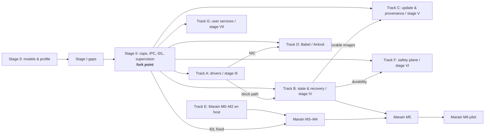

# MIND CORE — Roadmap v1.1

**Version:** 1.2 (1.1 → 1.2: stage II steps C1–C8 done; tracks A and D started with the VirtIO network driver)  
**Date:** 3 October 2026  
**Based on:** [Constitution v1.6](constitution/EN/MIND_CORE_Constitution_v1.6.md) and [RFC 001 Marain v0.4](constitution/EN/RFC_001_Marain_v0.4.md)  
**Russian version:** [ROADMAP_RU.md](ROADMAP_RU.md) (kept in sync; the English text is the reference)

This roadmap derives the order of work from the project's founding documents in [`constitution/`](constitution/) (English in [`constitution/EN`](constitution/EN), Russian in [`constitution/RU`](constitution/RU)) and from the code as of October 2026. It answers three questions: where the system stands against the Constitution, what has to be done first, and from which point the parts can be developed independently and in parallel.

Status of everything below the "Current state" section: **plan**. A stage counts as done only when its exit criteria are met and the evidence is in the repository (tests, models, measurements), per Constitution Article 12.3: a prototype may be incomplete, but it must not present intentions as guarantees.

## 1. Governing documents

| Document | Version | Role |
|---|---|---|
| [Constitution](constitution/EN/MIND_CORE_Constitution_v1.6.md) | 1.6 (2026-10-03) | Normative: Articles 1–12 with stable requirement IDs `MC-<article>.<clause>`; engineering profile (Appendix B), evidence (Appendix C), stages 0, I–VII and transition criteria (Appendix D) |
| [RFC 001 Marain](constitution/EN/RFC_001_Marain_v0.4.md) | 0.4 (2026-10-03) | Language RFC with its own stages M0–M7; subordinate to the Constitution |
| [Review](constitution/EN/review_2026-09-21.md) | 2026-09-21 | Basis of the changes in v1.6 / v0.4 and of priorities P0–P2 |
| [Archive](constitution/EN/archive/) | 1.4, 1.5, 0.2, 0.3 | Superseded editions, kept for history |

Version 1.6 is the full edition 1.4 with the accepted 1.5 amendments (2.6 `SHARE_RW`, 6.10 checkpoint protocol) and the review's corrections; RFC 0.4 is the full revision 0.2 with the accepted 0.3 amendments and a corrected `reconcile` (it never returns exclusive ownership on timeout). Article numbers below are the requirement IDs, e.g. "2.6" = `MC-2.6`.

Numbering: **stages 0, I–VII** belong to the Constitution (Appendix D); **M0–M7** belong to the Marain RFC. They are different scales; this roadmap uses both explicitly.

## 2. Current state against the Constitution

What exists (see [README](README.md) for details): x86-64 UEFI boot, SMP up to 8 CPUs, every task in ring 3 with its own page table and NX, 32 capability slots per task (endpoint with read/write/grant rights, memory, DMA, MMIO, ports, IRQ, input, display, spawn, one-time reply), synchronous IPC (send / call / reply, two words plus one capability), drivers in ring 3 (PS/2, ATA, AHCI, xHCI USB storage, AC97), FAT VFS server, loader service, audio gateway, text to speech, `libmind` SDK, QEMU and USB-image test suites.

| Constitution stage | State | Main gaps (article) |
|---|---|---|
| **0. Models and profile** | Done (profile 0.1) | [`docs/profile/`](docs/profile/README.md): threat and fault model, TCB per guarantee, kernel objects and limits, clocks, bootstrap authority, evidence, conformance table. Budgets are described as absent, not designed |
| **I. Protected execution** | Mostly there | Policy is out of the kernel (K1 done): `init` holds the bootstrap authority and service policy, the shell runs in ring 3. No DMA boundary: no IOMMU, DMA drivers are declared part of the TCB (1.5). Clock semantics are documented but `UPTIME` has 10 ms resolution (5.6). Kernel objects have fixed tables, not per-owner quotas (1.7, 5.1) |
| **II. Capabilities, IPC, minimal supervision** | Partial | Capabilities are slots without generations: a stale slot number can name a new object (3.2, 3.6). No derivation tree, attenuation of an existing capability or revocation with a completion point (3.4–3.6). Well-known endpoints are now handed out only by `init`, but their numbers are still global in the ABI (3.3, 3.12); `init` keeps the platform privilege after boot. IPC has no transfer modes (COPY/MOVE/SHARE_RO/LEASE), no bounded queues with back-pressure, no cancellation contract (2.5–2.8, 2.13). No interface description language (2.3). No supervisor, restart budget, instance generations or failure notification to an owner (6.1–6.9). No scheduling budgets (5.1–5.5) |
| **III. Driver vertical slice** | Early | Real drivers exist, but there is no device reset / DMA quiescence / restart path and no VirtIO (Appendix D, stage III) |
| **IV. State and recovery** | Not started | FAT is read-only; no content-addressed store, Head service, checkpoints (Article 4, 6.10) |
| **V. Update and distribution** | Not started | Boot images are not signed; no manifests, launch records, A/B activation, key roles (Article 9) |
| **VI. Safety plane** | Not started | — (Article 8) |
| **VII. User services** | Ahead of the plan | Compositor, audio gateway, TTS, shell already exist; they will need porting after stage II changes the capability and IPC ABI |
| **Assurance** (continuous) | Tests only | QEMU suites cover isolation, faults, IPC, drivers; no protocol models, fuzzing of the ABI, fault injection (Article 12.2, Appendix C) |

The issue tracker follows the rule in [`issues/README.md`](issues/README.md): `issues/` holds only near-term working tasks, finished and superseded ones move to [`issues-done/`](issues-done/). Issues 001–008 and 010 of the original prototype were closed on 2026-10-03.

## 3. Critical path — do first, in this order

These stages change the kernel ABI that everything else is built on. Working on other parts in parallel before them means porting that work later.

### Step 1. Documents and stage 0 (short; blocks nothing else from starting, but defines the targets)

- **D1. Constitution edition — done (2026-10-03).** Constitution v1.6 and RFC 001 v0.4 published; the review's P0 items on the texts are closed.
- **D2. Tracker — done for S0 and K1** (issues 019–021). Open one issue per further item of steps 2–3 when work on it starts.
- **S0. Platform profile `x86-64/QEMU-0` — done (2026-10-03, issue 019, [`docs/profile/`](docs/profile/README.md)).** Contents: threat and fault model; TCB per guarantee (firmware, bootloader, kernel, toolchain, and — while there is no IOMMU — every DMA-capable driver); kernel object model; budgets; clocks (monotonic in the kernel, calendar time as a service); bootstrap authority and the point where initial distribution of authority ends (3.12); plan of evidence. Output: `docs/profile/` documents referenced from the code.

### Step 2. Stage I gaps (kernel hardening)

- **K1. Policy out of the kernel — done (2026-10-03, issues 020, 021).** `init` holds the bootstrap authority (platform privilege) and decides which services start with which capabilities; `SPAWN` takes an explicit grant list; the command shell, UART handling and the Ctrl+Z policy run in ring 3; the kernel keeps focus, input delivery and resource validation as mechanisms (1.3, 1.4). Idle CPUs get a wake IPI when one of their tasks becomes ready.
- **K2. DMA boundary.** Profile statement done (DMA drivers are in the TCB, isolation from them is not claimed); VT-d with per-driver DMA domains remains task III-4 (1.5).
- **K3. Clocks — done (2026-10-03, issue 023).** `CLOCK` gives monotonic nanoseconds from the calibrated TSC (1 ns step in QEMU) with its resolution; the RTC service remains calendar time; `WAIT` keeps the 10 ms tick (5.6).
- **K4. Accounted kernel objects — done for tasks and endpoints (2026-10-03, issue 024).** Every task has a task and an endpoint quota delegated at `SPAWN` from its spawner's; `init` holds the root quota and gives `loader` the application limit; memory is still paid from the global kernel heap (1.7, 5.1, 3.13).

### Step 3. Stage II — the capability and IPC core (the gate)

- **C1. Capability space with generations — done (2026-10-03, issue 025).** Handles carry a 24-bit generation for kernel-allocated slots; stale handles fail; fixed slots 1–9 remain owner-managed (3.2, 3.6).
- **C2. Derivation and revocation — done (2026-10-03, issue 026).** Every capability has a parent; `CAP_MINT` attenuates (endpoint rights, port and memory sub-ranges), copy and move are distinct (`CAP_TRANSFER_MOVE`, `GRANT_MOVE`), `CAP_REVOKE` removes all descendants and returns when they are unusable; since C4 (issue 028) revoke also unmaps mappings made from the removed capabilities (3.4–3.6).
- **C3. No ambient names — done (2026-10-03, issue 027).** Endpoint numbers and `PLATFORM_ENDPOINT` are gone from the ABI; `init` creates service endpoints, keeps keeper capabilities (`CAP_KEEP`) and hands out derived server and client capabilities at spawn; restarts keep clients working (3.3, 3.12).
- **C4. IPC contract — done (2026-10-04, issues 028–030).** Memory rights, read-only mappings and leases ended by revoke; move-only memory objects and sealed read-only sharing; bounded endpoint queues, timeouts and cancellation. Read-write shares of the services were classified in C8. Goal: bounded queues with back-pressure; cancellation; COPY for small messages; memory objects with MOVE (single commit point, no two owners) and SHARE_RO (no writers during the read, including DMA); LEASE with explicit end of access; no SHARE_RW in the core profile (2.5–2.8, 2.11, 2.13).
- **C5. MIND IDL v0 — done (2026-10-04, issue 031).** WIT subset, generator `scripts/mind_idl.py`, bindings in `libmind::idl`, receiver-side checks; `rtc` is the first service on it, the others follow in C8. Goal: typed, versioned interface descriptions with size limits and the capability kinds a message may carry; generated Rust bindings in `libmind`; schema validation in the receiver, outside the kernel (2.3, 2.4, 2.12). WIT is the candidate representation (Appendix B.2).
- **C6. Minimal supervision — done (2026-10-04, issue 032).** Exit notices to the lifecycle owner (`TASK_WATCH`), automatic restart in `init` with a budget of 3 per 60 s and quarantine, sends to a dead instance fenced, halt without `init`. Not done: separating the supervisor from the bootstrap authority, DMA quiescing before a driver restart, idempotency rules. Goal: a supervisor tree in `init`: lifecycle owner and failure notification for every process, restart budgets, instance generations, endpoint generation checked by clients, reserve for recovery (6.1–6.9, Appendix B.4).
- **C7. Scheduling budgets — done (2026-10-04, issue 038).** Two bands (system before applications), CPU budget per period enforced at the 10 ms tick, `SCHED_SET` for the lifecycle owner. Not done: deadlines, admission control. Goal: scheduling contexts with budget and period; a supervisor's reserve survives overload of others (5.1–5.5).
- **C8. Port existing services — done (2026-10-04, issue 039).** `block`, `vfs`, `loader`, `init`, `audio`, `tts` and `rtc` interfaces in `idl/`; every service decodes requests with generated bindings. Memory transfers are leases ended by revoke, and the two `SHARE_RW` adapters (block buffer, screens read by the compositor) are listed in the profile. Goal: port the existing services (drivers, VFS, loader, audio, TTS, compositor) to C1–C7.

**Exit from stage II** (Constitution Appendix D, verbatim criteria): a capability cannot be forged, amplified or revived through a stale handle; copy/move/delegation are distinguishable; revocation has a completion point; boot authority is separated; all queues and allocations are accounted; enqueue + MOVE never creates two owners; cancellation and failure release or transfer the resource per contract; endpoint generation is checked; schemas are validated outside the kernel; the model of rights amplification, progress and stale access is checked within declared limits.

## 4. After stage II — independent parallel tracks

Once the stage II exit criteria hold, the kernel ABI (capabilities, IPC modes, IDL, supervision) is stable enough that the tracks below only depend on **published interfaces**, not on each other's internals. Each track can have its own owner and branch. Arrows are functional dependencies from Appendix D, not calendar order.

| Track | Constitution stage | Contents | Can start | Hard dependency for completion |
|---|---|---|---|---|
| **A. Drivers** | III | VirtIO block/net/input; device reset, DMA quiescence and driver restart under the supervisor; then port ATA/AHCI/xHCI/AC97 to the same restart contract; VT-d DMA domains (III-4) | After II; started: `virtio_net` (issue 100), modern VirtIO and MSI-X next (104); the AHCI, xHCI and AC97 drivers already restart after device quiesce | — |
| **B. State and recovery** | IV | Checksummed block store → CID and immutable blocks → manifests/Merkle-DAG → transactional Head/Refs service → retention/GC → checkpoint/rebind; a recovery set usable without the main store | After II (on a RAM disk) | Durable block path from track A |
| **C. Update and provenance** | V | Signed manifests and launch records (the manifest requests, it never grants: 3.11); A/B activation with last-known-good; key roles; reproducible toolchain (pinned `rust-toolchain`, `Cargo.lock`); AOT recipe keys | Signing and reproducible builds: now | Durable image storage from track B |
| **D. Babel / Airlock** | VII (Babel) | Network stack, policy broker, TLS service with non-exportable keys, session parsers with minimal authority; FAT and USB media as read-only projections with authorized import (Appendix B.6) | After II; issues 101–103 (stack, policy broker, TLS) | NIC driver from track A (issue 100); import into track B |
| **E. Marain** | RFC M0–M7 | M0 specification and M1 front end / M2 reference evaluator on a host bench; M3 Wasm component + runtime limits; M4 actors and protocols; M5 state/update; M6 cognitive-plane pilot and comparison with Rust bindings | **M0–M2: now** (host only) | M3–M4: IDL from C5; M5: track B; M6: tracks A/B services |
| **F. Safety plane** | VI | Control actors, authorized change of limits, justified deadlines, degradation when the cognitive plane fails; no JIT | After II and C7 budgets | Needed drivers (A), durability (B) |
| **G. User services** | VII | Compositor on display fences, audio, TTS, input methods, UI and localization (English and Russian); system tools — file manager, editor, `top`, memory map, load monitor ([plan](docs/tools/README.md)) | After C8 port; the system tools of the plan are done (issues 052–071, merged with `main` in 051); open: the `STAT` fields the monitors lost (075) | Only the interfaces they use |
| **Assurance** | continuous | Models of revoke / MOVE / checkpoint / fencing (e.g. TLA+); fuzzing of syscalls and IDL decoders; fault injection; recovery drills; evidence tied to configuration | **Now** | — |

Distribution (replication, fencing at the resource, remote capabilities through a gateway — Article 7) is part of stage V and starts after tracks B and D provide durable state and a transport.

## 5. What can run in parallel already now

Before the stage II gate, only work that does not depend on the kernel ABI is safe to parallelize:

1. **Documents**: keep `docs/profile/` in step with the code; new issues per D2.
2. **Assurance models**: specify and model-check capability revocation, MOVE commit and endpoint generations before implementing C1–C4; the review ranks this P1.
3. **Marain M0–M2** on a host bench, including the comparison baseline "same scenario in Rust with generated bindings" that the review recommends.
4. **Reproducible toolchain** (track C, first part): pinned toolchain, lockfile, build provenance.
5. **User-service features that do not touch IPC** (TTS voice quality, fonts, UI text). Anything that adds new IPC protocols should wait for C4/C5 to avoid a second port. For the system tools this is phase T0 of [docs/tools](docs/tools/README.md): program heap, 8×16 font, text UI library, key-event decoders, editor core.

Current open issues map onto this: [009](issues-done/009-gop-pixel-format.done) — stage I, [011](issues-done/011-reproducible-toolchain.done) — track C, [018](issues-done/018-kernel-panic-diagnostics.done) — assurance.

Kernel work (steps 2–3) should be done by one owner or in close coordination: K1, C1–C4 and C6 all change `kernel/src/scheduler.rs`, `common/abi.rs` and `libmind/src/{ipc,sys}.rs`.

## 6. Priorities at a glance

| Priority | Task | Done when |
|---|---|---|
| Done | D1 Constitution v1.6 and RFC v0.4 | Every v1.4 requirement kept, replaced or removed with a reason; timeout never creates a second owner |
| Done | S0 profile and models | TCB, threat/fault model, clocks, bootstrap authority written and referenced from the code |
| Done | K1 policy out of the kernel | Kernel has no shell or driver-selection policy; `init` holds bootstrap authority |
| Done | K3, K4 clocks and accounted kernel objects | Monotonic clock with stated resolution; per-owner quotas for tasks and endpoints |
| Done | C1–C8: capabilities, IPC modes, MIND IDL, supervision, budgets, services ported | Stage II capability, IPC and supervision criteria pass in tests (issues 025–039, 044) |
| P1 | Assurance models for revoke/MOVE | Invariants, assumptions and counterexamples checked (the remaining stage II exit criterion) |
| P1 | Track A: VirtIO net, then block and input | Drivers restart under the supervisor with device quiesce (issue 100) |
| P2 | Track D: network stack, policy broker, TLS | Flows as capabilities with quotas (issues 101–103) |
| P2 | Tracks B, C, E–G in parallel | Per track |

## 7. Maintenance of this roadmap

- Each task above gets an issue in `issues/` that names the Constitution articles it serves and its evidence.
- When a stage's exit criteria are met, record the evidence (test names, model files, measurements) here and in `knowledge/`.
- A change of the Constitution or the profile that alters a guarantee updates this roadmap in the same commit (Article 12.9).
- The roadmap version is raised when a stage is completed or the order of work changes; the Russian version is updated in the same commit.
