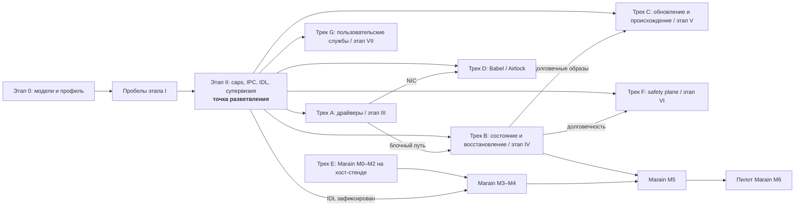

# MIND CORE — Дорожная карта v1.1

**Версия:** 1.1 (1.0 → 1.1: выполнены S0 и K1)  
**Дата:** 3 октября 2026 года  
**Основание:** [Конституция v1.6](constitution/RU/MIND_CORE_Constitution_v1.6.md) и [RFC 001 Marain v0.4](constitution/RU/RFC_001_Marain_v0.4.md)  
**Английская версия:** [ROADMAP.md](ROADMAP.md) (синхронизируется; эталон — английский текст)

Дорожная карта выводит порядок работ из основополагающих документов проекта в [`constitution/`](constitution/) (русский текст — [`constitution/RU`](constitution/RU), английский — [`constitution/EN`](constitution/EN)) и из состояния кода на октябрь 2026 года. Она отвечает на три вопроса: где система находится относительно Конституции, что нужно сделать в первую очередь и с какого момента части можно разрабатывать независимо и параллельно.

Всё, что ниже раздела «Текущее состояние», — **план**. Этап считается пройденным, только когда выполнены его критерии перехода и свидетельства лежат в репозитории (тесты, модели, измерения) — по статье 12.3 Конституции: прототип может быть неполным, но не должен выдавать намерения за гарантии.

## 1. Основополагающие документы

| Документ | Версия | Роль |
|---|---|---|
| [Конституция](constitution/RU/MIND_CORE_Constitution_v1.6.md) | 1.6 (2026-10-03) | Нормативна: статьи 1–12 со стабильными идентификаторами требований `MC-<статья>.<пункт>`; инженерный профиль (приложение Б), свидетельства (приложение В), этапы 0, I–VII и критерии перехода (приложение Г) |
| [RFC 001 Marain](constitution/RU/RFC_001_Marain_v0.4.md) | 0.4 (2026-10-03) | RFC языка со своими этапами M0–M7; подчинён Конституции |
| [Рецензия](constitution/RU/review_2026-09-21.md) | 2026-09-21 | Основание изменений v1.6 / v0.4 и приоритетов P0–P2 |
| [Архив](constitution/RU/archive/) | 1.4, 1.5, 0.2, 0.3 | Заменённые редакции, сохранены для истории |

Редакция 1.6 — это полная редакция 1.4 с принятыми поправками 1.5 (2.6 `SHARE_RW`, 6.10 протокол контрольной точки) и исправлениями по рецензии; RFC 0.4 — полная редакция 0.2 с принятыми поправками 0.3 и исправленным `reconcile` (он никогда не возвращает исключительное владение по тайм-ауту). Номера пунктов ниже — идентификаторы требований, например «2.6» = `MC-2.6`.

Нумерация: **этапы 0, I–VII** принадлежат Конституции (приложение Г); **M0–M7** — RFC Marain. Это разные шкалы; дорожная карта использует обе явно.

## 2. Текущее состояние относительно Конституции

Что есть (подробности в [README](README.md)): загрузка x86-64 через UEFI, SMP до 8 процессоров, каждая задача в ring 3 со своей таблицей страниц и NX, 32 слота capabilities на задачу (endpoint с правами read/write/grant, память, DMA, MMIO, порты, IRQ, ввод, экран, spawn, одноразовый reply), синхронный IPC (send / call / reply, два слова и одна capability), драйверы в ring 3 (PS/2, ATA, AHCI, USB-накопитель через xHCI, AC97), VFS-сервер FAT, служба loader, аудиошлюз, синтез речи, SDK `libmind`, тестовые наборы QEMU и USB-образа.

| Этап Конституции | Состояние | Главные пробелы (пункт) |
|---|---|---|
| **0. Модели и профиль** | Выполнен (профиль 0.1) | [`docs/profile/`](docs/profile/README.md): модель угроз и отказов, TCB по гарантиям, объекты ядра и пределы, часы, начальная власть, свидетельства, таблица соответствия. Бюджеты описаны как отсутствующие, а не спроектированы |
| **I. Защищённое исполнение** | В основном есть | Политика вынесена из ядра (K1 выполнен): `init` держит начальную власть и политику служб, оболочка работает в ring 3. Границы DMA нет: IOMMU не используется, драйверы с DMA заявлены частью TCB (1.5). Семантика часов описана, но разрешение `UPTIME` — 10 мс (5.6). Объекты ядра — фиксированные таблицы, а не квоты владельцев (1.7, 5.1) |
| **II. Capabilities, IPC, минимальная супервизия** | Частично | Capabilities — слоты без поколений: устаревший номер слота может указать на новый объект (3.2, 3.6). Нет дерева производных прав, ослабления существующей capability и отзыва с точкой завершения (3.4–3.6). Известные endpoints теперь выдаёт только `init`, но их номера по-прежнему глобальны в ABI (3.3, 3.12); после загрузки `init` сохраняет платформенную привилегию. У IPC нет режимов передачи (COPY/MOVE/SHARE_RO/LEASE), ограниченных очередей с обратным давлением, контракта отмены (2.5–2.8, 2.13). Нет языка описания интерфейсов (2.3). Нет супервизора, бюджета перезапусков, поколений экземпляров, уведомления владельца об отказе (6.1–6.9). Нет бюджетов планирования (5.1–5.5) |
| **III. Вертикальный срез драйверов** | Начальный | Реальные драйверы есть, но нет сброса устройства, остановки DMA и перезапуска, нет VirtIO (приложение Г, этап III) |
| **IV. Состояние и восстановление** | Не начат | FAT только для чтения; нет адресуемого по содержимому хранилища, Head-сервиса, контрольных точек (статья 4, 6.10) |
| **V. Обновление и распределение** | Не начат | Загрузочные образы не подписаны; нет манифестов, записей запуска, A/B-активации, ролей ключей (статья 9) |
| **VI. Safety plane** | Не начат | — (статья 8) |
| **VII. Пользовательские службы** | Опережают план | Композитор, аудиошлюз, синтез речи, оболочка уже есть; после того как этап II изменит ABI capabilities и IPC, их придётся перенести |
| **Assurance** (постоянно) | Только тесты | Наборы QEMU проверяют изоляцию, отказы, IPC, драйверы; нет моделей протоколов, fuzzing ABI, внедрения отказов (12.2, приложение В) |

Задачи ведутся по правилу из [`issues/README.md`](issues/README.md): в `issues/` лежат только рабочие задачи ближайшего времени, выполненные и устаревшие переносятся в [`issues-done/`](issues-done/). Задачи 001–008 и 010 исходного прототипа закрыты 3 октября 2026 года.

## 3. Критический путь — сделать в первую очередь, в этом порядке

Эти этапы меняют ABI ядра, на котором строится всё остальное. Параллельная работа над другими частями до них означает, что её потом придётся переносить.

### Шаг 1. Документы и этап 0 (короткий; ничему не мешает начаться, но задаёт цели)

- **D1. Редакция Конституции — выполнено (2026-10-03).** Опубликованы Конституция v1.6 и RFC 001 v0.4; пункты P0 рецензии по текстам закрыты.
- **D2. Задачи — выполнено для S0 и K1** (задачи 019–021). Для следующих пунктов шагов 2–3 задача заводится, когда начинается работа.
- **S0. Платформенный профиль `x86-64/QEMU-0` — выполнено (2026-10-03, задача 019, [`docs/profile/`](docs/profile/README.md)).** Содержание: модель угроз и отказов; TCB для каждой гарантии (firmware, загрузчик, ядро, toolchain и — пока нет IOMMU — каждый драйвер с DMA); модель объектов ядра; бюджеты; часы (монотонные — в ядре, календарное время — служба); начальная власть и точка завершения начального распределения полномочий (3.12); план свидетельств. Результат: документы `docs/profile/`, на которые ссылается код.

### Шаг 2. Пробелы этапа I (укрепление ядра)

- **K1. Политика — вне ядра — выполнено (2026-10-03, задачи 020, 021).** `init` держит начальную власть (платформенную привилегию) и решает, какие службы с какими capabilities запускать; `SPAWN` принимает явный список передаваемых прав; командная оболочка, работа с UART и политика Ctrl+Z — в ring 3; в ядре остались фокус, доставка ввода и проверка ресурсов как механизмы (1.3, 1.4). Простаивающий процессор получает IPI, когда его задача становится готовой.
- **K2. Граница DMA.** Заявление в профиле сделано (драйверы с DMA входят в TCB, изоляция от них не заявляется); VT-d с отдельными DMA-доменами остаётся задачей III-4 (1.5).
- **K3. Часы — выполнено (2026-10-03, задача 023).** `CLOCK` выдаёт монотонные наносекунды по откалиброванному TSC (шаг 1 нс в QEMU) и их разрешение; служба RTC остаётся календарным временем; `WAIT` по-прежнему работает с тиком 10 мс (5.6).
- **K4. Учтённые объекты ядра — выполнено для задач и endpoints (2026-10-03, задача 024).** У каждой задачи есть квота задач и квота endpoints, выделяемые при `SPAWN` из квот запускающего; корневая квота у `init`, он даёт `loader` предел числа приложений; память по-прежнему оплачивается из общей кучи ядра (1.7, 5.1, 3.13).

### Шаг 3. Этап II — ядро capabilities и IPC (шлюз)

- **C1. Пространство capabilities с поколениями — выполнено (2026-10-03, задача 025).** Handle несёт 24-битное поколение для слотов, выдаваемых ядром; устаревший handle отвергается; фиксированные слоты 1–9 остаются под управлением владельца (3.2, 3.6).
- **C2. Производные права и отзыв — выполнено (2026-10-03, задача 026).** У каждой capability есть родитель; `CAP_MINT` ослабляет права (права endpoint, поддиапазоны портов и памяти), копирование и перемещение различаются (`CAP_TRANSFER_MOVE`, `GRANT_MOVE`), `CAP_REVOKE` удаляет всех потомков и возвращается, когда они уже непригодны; отображения памяти при отзыве не снимаются (C4) (3.4–3.6).
- **C3. Без неявных имён — выполнено (2026-10-03, задача 027).** Номера endpoints и `PLATFORM_ENDPOINT` убраны из ABI; `init` создаёт endpoints служб, хранит keeper-capabilities (`CAP_KEEP`) и при запуске выдаёт производные capabilities серверу и клиентам; при перезапуске службы клиенты продолжают работать (3.3, 3.12).
- **C4. Контракт IPC — выполнено (2026-10-04, задачи 028–030).** Права на память, отображения только для чтения и аренда, завершаемая отзывом; объекты памяти только с перемещением и запечатанное разделение для чтения; ограниченные очереди endpoints, таймауты и отмена. Осталось: службы всё ещё используют разделение на запись (C8). Цель: ограниченные очереди с обратным давлением; отмена; COPY для малых сообщений; объекты памяти с MOVE (одна точка фиксации, никогда два владельца) и SHARE_RO (никаких записей на время чтения, включая DMA); LEASE с явным прекращением доступа; без SHARE_RW в базовом профиле (2.5–2.8, 2.11, 2.13).
- **C5. MIND IDL v0 — выполнено (2026-10-04, задача 031).** Подмножество WIT, генератор `scripts/mind_idl.py`, привязки в `libmind::idl`, проверки на стороне получателя; первая служба на нём — `rtc`, остальные переводятся в C8. Цель: типизированные версионируемые описания интерфейсов с пределами размеров и видами capabilities, которые может нести сообщение; генерация Rust-привязок в `libmind`; проверка схемы у получателя, вне ядра (2.3, 2.4, 2.12). Кандидат представления — WIT (приложение Б.2).
- **C6. Минимальная супервизия.** Дерево супервизоров в `init`: владелец жизненного цикла и уведомление об отказе для каждого процесса, бюджеты перезапусков, поколения экземпляров, проверка поколения endpoint клиентами, резерв на восстановление (6.1–6.9, приложение Б.4).
- **C7. Бюджеты планирования.** Контексты планирования с бюджетом и периодом; резерв супервизора сохраняется при перегрузке остальных (5.1–5.5).
- **C8. Перенос существующих служб** (драйверы, VFS, loader, аудио, синтез речи, композитор) на C1–C7.

**Выход из этапа II** (приложение Г Конституции, критерии дословно): capability нельзя подделать, усилить или оживить устаревшим handle; copy/move/delegation различимы; отзыв имеет точку завершения; boot authority разделена; все очереди и аллокации учитываются; enqueue + MOVE не создаёт двух владельцев; отмена и отказ освобождают либо передают ресурс по контракту; поколение endpoint проверяется; схема валидируется вне ядра; проверена модель усиления прав, прогресса и stale access с объявленными пределами.

## 4. После этапа II — независимые параллельные треки

Когда критерии выхода из этапа II выполнены, ABI ядра (capabilities, режимы IPC, IDL, супервизия) достаточно стабилен, и треки ниже зависят только от **опубликованных интерфейсов**, а не от внутреннего устройства друг друга. У каждого трека может быть свой ответственный и своя ветка. Стрелки — функциональные зависимости из приложения Г, а не календарный порядок.

| Трек | Этап Конституции | Содержание | Можно начинать | Жёсткая зависимость для завершения |
|---|---|---|---|---|
| **A. Драйверы** | III | VirtIO block/net/input; сброс устройства, остановка DMA и перезапуск драйвера под супервизором; затем перевод ATA/AHCI/xHCI/AC97 на тот же контракт перезапуска; DMA-домены VT-d (III-4) | После II | — |
| **B. Состояние и восстановление** | IV | Блочное хранилище с контрольными суммами → CID и неизменяемые блоки → манифесты/Merkle-DAG → транзакционный Head/Refs-сервис → удержание/GC → checkpoint/rebind; набор восстановления, работающий без основного хранилища | После II (на RAM-диске) | Долговечный блочный путь из трека A |
| **C. Обновление и происхождение** | V | Подписанные манифесты и записи запуска (манифест запрашивает, но не выдаёт: 3.11); A/B-активация с last-known-good; роли ключей; воспроизводимый toolchain (закреплённый `rust-toolchain`, `Cargo.lock`); ключи рецептов AOT | Подпись и воспроизводимая сборка: сейчас | Долговечное хранение образов из трека B |
| **D. Babel / Airlock** | VII (Babel) | Сетевой стек, policy broker, TLS-служба с неэкспортируемыми ключами, парсеры сессий с минимальными правами; носители FAT и USB как проекции только для чтения с авторизованным импортом (приложение Б.6) | После II | Сетевой драйвер из трека A; импорт в трек B |
| **E. Marain** | RFC M0–M7 | M0 спецификация и M1 frontend / M2 reference evaluator на хост-стенде; M3 Wasm-компонент и лимиты runtime; M4 акторы и протоколы; M5 состояние и обновление; M6 пилот cognitive plane и сравнение с Rust-привязками | **M0–M2: сейчас** (только хост) | M3–M4: IDL из C5; M5: трек B; M6: службы треков A/B |
| **F. Safety plane** | VI | Control-акторы, авторизованное изменение пределов, обоснованные сроки, деградация при отказе cognitive plane; без JIT | После II и бюджетов C7 | Нужные драйверы (A), долговечность (B) |
| **G. Пользовательские службы** | VII | Композитор на display fences, аудио, синтез речи, методы ввода, интерфейс и локализация (английский и русский) | После переноса C8 | Только используемые ими интерфейсы |
| **Assurance** | постоянно | Модели revoke / MOVE / checkpoint / fencing (например, TLA+); fuzzing системных вызовов и декодеров IDL; внедрение отказов; учения по восстановлению; привязка свидетельств к конфигурации | **Сейчас** | — |

Распределённость (репликация, fencing у ресурса, удалённые capabilities через шлюз — статья 7) входит в этап V и начинается после того, как треки B и D дадут долговечное состояние и транспорт.

## 5. Что можно вести параллельно уже сейчас

До шлюза этапа II безопасно распараллеливать только работу, не зависящую от ABI ядра:

1. **Документы**: поддерживать `docs/profile/` в соответствии с кодом; новые задачи по D2.
2. **Модели для assurance**: специфицировать и проверить на модели отзыв capabilities, фиксацию MOVE и поколения endpoints до реализации C1–C4; рецензия относит это к P1.
3. **Marain M0–M2** на хост-стенде, включая базу сравнения «тот же сценарий на Rust со сгенерированными привязками», которую рекомендует рецензия.
4. **Воспроизводимый toolchain** (первая часть трека C): закреплённый toolchain, lock-файл, происхождение сборки.
5. **Функции пользовательских служб, не затрагивающие IPC** (качество голоса синтеза, шрифты, тексты интерфейса). Всё, что добавляет новые протоколы IPC, лучше отложить до C4/C5, чтобы не переносить дважды.

Текущие открытые задачи: [009](issues/009-gop-pixel-format.md) — этап I, [011](issues/011-reproducible-toolchain.md) — трек C, [018](issues/018-kernel-panic-diagnostics.md) — assurance.

Работы в ядре (шаги 2–3) должен вести один ответственный или при тесной координации: K1, C1–C4 и C6 меняют одни и те же файлы — `kernel/src/scheduler.rs`, `common/abi.rs` и `libmind/src/{ipc,sys}.rs`.

## 6. Приоритеты кратко

| Приоритет | Задача | Готово, когда |
|---|---|---|
| Выполнено | D1 Конституция v1.6 и RFC v0.4 | Каждое требование v1.4 сохранено, заменено или удалено с обоснованием; тайм-аут не создаёт второго владельца |
| Выполнено | S0 профиль и модели | TCB, модель угроз и отказов, часы, начальная власть описаны и на них ссылается код |
| Выполнено | K1 политика вне ядра | В ядре нет оболочки и политики выбора драйверов; `init` держит начальную власть |
| Выполнено | K3, K4 часы и учтённые объекты ядра | Монотонные часы с заявленным разрешением; квоты владельцев для задач и endpoints |
| P1 | C1–C3 capabilities | Критерии этапа II для capabilities проходят в тестах и на модели |
| P1 | C4–C5 режимы IPC и IDL | Ограниченные очереди, контракты MOVE/SHARE_RO/LEASE, сгенерированные привязки |
| P1 | C6–C7 супервизия и бюджеты | Отказ любой службы доходит до владельца, служба перезапускается в пределах бюджета |
| P1 | Модели assurance для revoke/MOVE | Инварианты, предположения и контрпримеры проверены |
| P2 | Перенос C8; затем треки A–G параллельно | Критерии выхода из этапа II выполнены |

## 7. Ведение дорожной карты

- Каждая задача выше получает файл в `issues/` с указанием пунктов Конституции, которым она служит, и её свидетельств.
- Когда критерии этапа выполнены, свидетельства (имена тестов, файлы моделей, измерения) записываются сюда и в `knowledge/`.
- Изменение Конституции или профиля, затрагивающее гарантию, обновляет дорожную карту в том же коммите (12.9).
- Версия дорожной карты повышается при завершении этапа или изменении порядка работ; русская версия обновляется в том же коммите.
