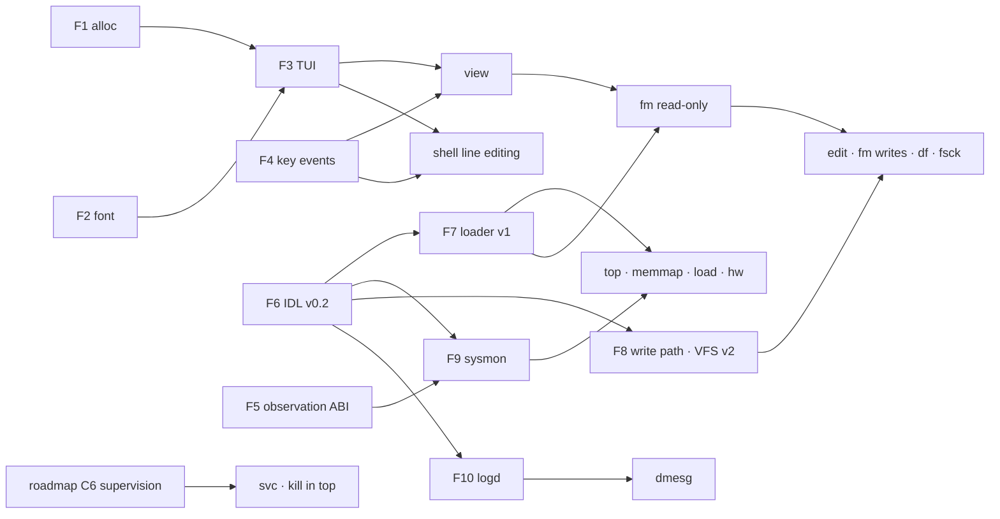

# System tools — plan

**Version:** 0.1 (2026-10-04) · **Roadmap:** [track G](../../ROADMAP.md) (user services), with dependencies on C6–C8 · **Constitution:** [v1.6](../../constitution/EN/MIND_CORE_Constitution_v1.6.md) MC-1.1, 2.3, 2.6, 3.3, 3.7, 3.11, 4, 5.4, 5.5, 10.2, 10.3, 10.6, B.6 · **Russian version:** [README_RU.md](README_RU.md) (kept in sync; the English text is the reference)

Status of everything below: **plan**. Nothing here is implemented yet; each item becomes an issue in [`issues/`](../../issues/README.md) when work on it starts.

MIND CORE has a command shell and demo programs, but no tools to work with files or to watch the system. This document

1. lists the tools the system needs: the three requested ones — a full-screen panel text editor, a two-panel file manager, `top` — and the others that follow from what the system already has (memory map, load monitor, devices, services, capabilities, IPC, logs, disks);
2. names the foundation these tools lack today and how to build it without breaking the Constitution;
3. splits the work into phases with exit criteria and places them against the roadmap.

## 1. What the tools can build on today

| Area | What exists | What limits the tools |
|---|---|---|
| Display | Every application has its own screen buffer; `compositor` copies the focused one to the framebuffer; `mind::gfx::Screen` draws pixels and 8×8 text | The font (`common/font.rs`) has 64 glyphs, ASCII 32–95: no lower case (drawn as upper case), no Cyrillic, no box-drawing characters. Colours assume BGR ([issue 009](../../issues-done/009-gop-pixel-format.done)) |
| Keyboard | `ps2_kbd` → `INPUT_EVENT` → the focused task reads bytes with `READ_KEY` | An application gets raw PS/2 make codes *or* raw UART bytes in one byte stream (0x1E is both scan code "A" and UART byte 0x1E). E0-prefixed keys — arrows, Home/End, PgUp/PgDn, Ins/Del — are dropped by the driver. No key release, modifiers or layouts. Ctrl+Z is the system attention key |
| Program memory | `Pages` page blocks (`ALLOC`/`FREE`), 32 blocks and 16 MiB per task | No sub-page allocator, so programs cannot use `alloc` (`Vec`, `String`) |
| Files | `vfs_server`: FAT12/16/32, `OPEN`/`READ`/`LIST`/`STAT`, long names, subdirectories | Read-only; the block protocol has no write; long-name characters ≥ 0x80 become `?`; one volume; global path names; `LIST` gives no time or attributes |
| Starting programs | `loader` starts an application with a fixed grant set (rtc, vfs, audio, loader, tts, optionally an endpoint in the INIT slot) and always with a screen | A tool cannot be given an extra capability at launch (system information, a writable file, service control) |
| Observation | `TASK_LIST` (PID, name, state, CPU, runs, ticks, syscalls), `CPU_INFO` (ticks per CPU), `KERNEL_HEAP` (used/free), `FAULTS` | All of it needs the process-control privilege that only the shell holds and that also allows kill, focus, halt and reading logs. No per-task memory, no idle time, no IRQ or IPC counters, no address-space map. The bootloader discards the UEFI memory map after `exit_boot_services` |
| Interfaces | MIND IDL v0 ([docs/idl](../idl/README.md)) | Two words and one capability per message: no strings, records or lists |
| Shell | `ps`, `cpus`, `faults`, `heap`, `clock`, `logs`, `list`, `run`/`fg`/`kill` | No line editing or history; output of a foreground program is mirrored to COM1 only |
| Limits | 20 tasks in total, 8 applications; 64 MiB kernel arena; each screen is a full frame in that arena | Two more services (below) use 2 of the 20 task slots; several tools with screens at once cost several frames of kernel memory |

## 2. Tool catalogue

Priority: **P0** — requested, or needed by a requested tool; **P1** — next; **P2** — later or after other tracks.

### 2.1 Files and text

| Tool | Purpose | Needs (data, authority) | Priority |
|---|---|---|---|
| `fm` | Two-panel file manager in the Norton Commander / FAR style | Directory handles: read-only for `/`, read-write for the user's data directory; loader (run a program, open the editor) | P0 |
| `edit` | Full-screen panel text editor (mcedit / FAR editor style) | One file handle given at launch (read-write or read-only) | P0 |
| `view` | Text and hex viewer; the same code is `fm`'s F3 | A read-only file handle | P0 — the first tool that works on today's read-only VFS |
| `df`, `fsck` | Volumes, size and free space; read-only FAT consistency check | Volume information from VFS | P1 (`fsck` is also the test oracle for FAT writes) |
| `find`, `grep` | Search by name and content: in `fm` (Alt+F7) and as console tools | Read-only directory handle | P2 — done in issue 082 (`search/`, `mind::pattern`) |
| `format` | Create a FAT volume on the RAM disk or a data partition | Write right on the chosen block device, explicit confirmation | P2 — done for the RAM disk in issue 083 (`vfs.wit` 2.3 `format`; confirmation by `-y`) |

### 2.2 Observation

| Tool | Purpose | Needs | Priority |
|---|---|---|---|
| `top` | Tasks and CPU use, interactive: sort, tree by spawner, details | `sysinfo` (§3, F5, F9) | P0 |
| `memmap` | Memory map: physical layout, kernel arena, address space of a process, quotas | `sysinfo` | P0 |
| `load` | Load monitor: CPU per core, interrupts, syscalls, IPC, memory over time; load averages | `sysinfo` history | P0 |
| `hw` | CPUs, clocks, framebuffer mode, PCI devices and the service that holds each, IRQ lines, DMA regions, block and audio devices | `sysinfo` | P1 |
| `ipc` | Endpoints, who serves and who holds them, queue depth, blocked tasks, wait-for graph with cycles highlighted | `sysinfo` | P1 |
| `caps` | Capabilities of a task (kind, rights, generation, range, derivation parent); derivation tree; what a revoke would remove | `sysinfo` with a stronger right (the authority graph is sensitive) | P1 |
| `dmesg` | System log: boot, init, services, faults, with source and time | `logd` (F10) | P1 |
| `uptime`, `free`, `date` | One-line console summaries (`free`: the machine's memory, the frame pool programs run in, first, then the kernel arena; 211-APP-0057); `date set YYYY-MM-DD HH:MM[:SS]` sets the clock through the shell's setting client (`rtc.wit` 1.2, 211-APP-0042; the clock keeps no time zone) | `sysinfo`, `rtc` | P2 |

### 2.3 Services and control

| Tool | Purpose | Needs | Priority |
|---|---|---|---|
| `svc` | Boot services: state, PID, restarts, devices held; start, stop, restart | init's lifecycle interface (roadmap C6) | P1 |
| `reboot` | Reboot after flushing file systems (`stop` already halts) | Process control, VFS flush | P2 |
| `keymap` | Keyboard layout (English, Russian) and the switch key | Input settings | P2 |
| `screenshot` | Save the screen as BMP | Display read right from `compositor`, a file handle | P2 |
| `record` | Record the screen as AVI (Motion JPEG) | The shell's `compositor` client (`REQUEST_DISPLAY`), the user's files | P2 |
| `efivar` | The firmware's boot variables: `BootCurrent`, `BootNext`, `BootOrder` and the `Boot####` entries; sets `BootNext` (`bootnext <hex>`, `delete bootnext`) and `BootOrder` (`bootorder <hex>,…`), and appends a signed signature list to `db`, `dbx` or `KEK` (`append`). On x86 and aarch64 (351-KRN-0027, 351-KRN-0028) | The firmware privilege (`REQUEST_FIRMWARE`), which the shell lends only after the user agrees, asked every time; a script must declare `firmware`, and the user is still asked | P2 — done by the kernel track |

### 2.4 Shell as the launcher

Line editing (arrows, Home/End, Del), history, completion of program names and paths, lower case and Cyrillic on screen, scrollback, and **console programs**: a program started without a screen stays in the shell's foreground and its console output is drawn in the shell. That makes `uptime`, `df`, `dmesg`, `find` simple console tools. Line editing is P0 (it needs the same key events as the editor); the rest is P1.

## 3. Foundation

Ten building blocks; the tools in §4 are thin on top of them.

| ID | Block | Where | Size | Can start |
|---|---|---|---|---|
| F1 | Program heap `mind::alloc` | `libmind` | S–M | Now |
| F2 | 8×16 font with Cyrillic and box drawing | `common/`, `scripts/` | S | Now |
| F3 | TUI library `mind::tui` | `libmind` | M | After F1, F2 |
| F4 | Key events | `ps2_kbd`, `shell`, kernel, `libmind` | M | Now (kernel part coordinated) |
| F5 | Observation ABI | kernel, `common/abi.rs`, bootloader | M–L | With the kernel owner, next to C6/C7 |
| F6 | MIND IDL v0.2: records, strings and lists in a buffer | `scripts/mind_idl.py`, `libmind/src/idl` | M | Now |
| F7 | Launch with granted capabilities | `loader`, `shell`, `libmind` | M | After F6 |
| F8 | Write path: block write, RAM disk, VFS v2 with directory handles | drivers, `vfs_server`, kernel (badges) | L | After F6; VFS part is its C8 port |
| F9 | `sysmon` service | new service | M | After F5, F6 |
| F10 | `logd` service | new service | S–M | After F6 |

### F1. Program heap

- A `GlobalAlloc` in `libmind` behind a cargo feature `alloc`: size classes 16 B – 2 KiB in 64 KiB slabs, larger allocations as their own page blocks. Arenas grow in 1 MiB steps so that the per-task limits (32 blocks, 16 MiB) are not used up by small blocks. Allocation failure returns null; `handle_alloc_error` logs and exits the task.
- Services do not enable the feature and keep static memory, so their footprint stays fixed (MC-5.1).
- Host tests against a simulated page source.

### F2. Font

- 8×16 bitmap: ASCII, Latin-1, Cyrillic U+0400–U+045F (with Ё/ё), box drawing U+2500–U+257F (at least the single and double lines panels use), block elements U+2580–U+259F (bars and graphs), arrows, «», —, №, … — about 450 glyphs, ~7 KiB.
- Source: an existing BDF font whose licence and coverage are confirmed and recorded next to the data, as for the TTS dictionaries (candidate: Terminus, SIL OFL 1.1). `scripts/font_gen.py` converts it into a generated, committed `common/font16.rs`; a test fails if it is stale (as `tests/idl_test.py` does for IDL bindings).
- Lookup by a sorted table of code points (binary search, as in the TTS lexicons); unknown characters get a replacement glyph. The 8×8 font stays for the existing demos.
- Grid size: 800×600 → 100×37 cells, 1024×768 → 128×48, 1280×800 → 160×50. A fixed target mode in the bootloader ([issue 009](../../issues-done/009-gop-pixel-format.done)) makes layouts predictable.

### F3. TUI library

- Cell grid (character, foreground, background, attributes), a back buffer and a diff: only changed cells are drawn into `Screen`. Cursor, palettes (classic blue Norton-style and dark).
- Widgets: frame, scrollable list with selection (a panel), table with columns and sort, menu bar with drop-down menus, dialogs (message, confirm, input), input line with editing and history, status line and F-key bar, progress bar, gauge, time-series graph from block elements.
- Event loop: wait for a key event or a timeout (`WAIT` already wakes early on input).
- Host-testable: rendering into an in-memory grid, tests compare grids.
- Optional later (track G): the compositor scans the whole screen on every dirty frame; a damage-rectangle hint would cut that for text tools.

### F4. Key events

- One event format for every input path: `KeyEvent { key, mods, ch, pressed }` packed into one word — key codes for printable keys, Enter, Esc, Tab, Backspace, arrows, Home/End, PgUp/PgDn, Ins/Del, F1–F12; Shift/Ctrl/Alt; the character from the active layout; press or release.
- Kernel (mechanism only, MC-1.1): the per-task input queue holds events instead of bytes (64 entries), `INPUT_EVENT` takes an event word, a new `READ_INPUT` returns one. `READ_KEY` stays for the existing programs until they are ported. The attention flag (Ctrl+Z) is unchanged. No decoding or layouts in the kernel.
- `ps2_kbd`: E0 prefix, break codes, modifier state, Caps Lock, layouts US and Russian ЙЦУКЕН with a switch key (layout policy lives in ring 3; later an input-method service, track G).
- Shell (it owns COM1): decoder of VT100/xterm sequences (`ESC [ A`–`D`, `ESC [ H`/`F`, `ESC [ n ~`, `ESC O P`–`S`) with a 50 ms timeout that tells a lone Esc from a sequence; UTF-8 from the UART is already accepted.
- `mind::input`: `read_event()`, `wait_event(ms)`; `wait_or_exit` keeps working. With `pointer(true)` a program gets the mouse too (issue 156): `read_input()`, and `wait_key_pointer_or_modifiers` for a program with a key bar (issue u001); `Pointer` carries the buttons, the motion, the wheel (negative: up) and the cell — on a screen it follows the motion within the grid `Terminal` sets, in a window `wm` says it. `Terminal::show_pointer` shows that cell inverted on a screen.
- Reserved key: Ctrl+Z is the system attention key, so no tool can use it (the editor's undo is Ctrl+U and Alt+Backspace).

### F5. Observation ABI

- **Privilege split.** A new privilege kind `CAP_KIND_OBSERVE` (read-only statistics). `TASK_LIST`, `CPU_INFO`, `KERNEL_HEAP`, `FAULTS` and the new `STAT` accept OBSERVE or CONTROL; kill, focus, halt, logs and console output stay CONTROL only — reading another task's output is reading its data (MC-10.2). `init` mints OBSERVE only for `sysmon`.
- **One system call** `STAT(class, buffer, capacity, argument)` returning versioned fixed-size records (`StatHeader { version, record_size, count, total }`). The copy is made under the scheduler lock and is bounded by the table sizes (20 tasks, 64 endpoints, 32 slots, 16 IRQ lines), so the non-preemptible time has a bound (MC-5.4).
- **Classes:**
  - `TASKS`: PID, spawner PID, name, state and what the task waits for (send/receive/call on endpoint *k*, reply, sleep, IRQ), CPU, runs, ticks, run time in ns, syscalls, IPC sends and receives, private heap bytes and blocks, shared bytes, image/stack/screen bytes, used capability slots, task and endpoint quota used/limit, start time.
  - `CPUS`: APIC id, online, timer ticks, busy ns, idle ns, interrupts, IPIs, context switches, current PID.
  - `MEMORY`: kernel arena size, used, free, largest free block, number of free fragments; bytes by category (task images, stacks, contexts, screens, private heaps, memory objects, retained orphans, DMA); global limits (DMA 8 MiB, memory objects 16 MiB).
  - `PHYSMAP`: the firmware memory map (type, start, pages) and the platform layout the kernel knows: kernel image, heap arena, boot images, framebuffer, AP trampoline, PCI BARs.
  - `VMAP(pid)`: regions of an address space: start, size, kind (code, data, stack, guard, screen, info page, mailbox, heap block, shared mapping, device registers), rights R/W/X, private/shared/device.
  - `CAPS(pid)`: slot, generation, kind, rights, size or port range, derivation node and parent.
  - `ENDPOINTS`: per live endpoint an observation index, its creator, holders of the receive right, waiting senders, pending replies, `ERR_BUSY` rejections, timeouts.
  - `IRQS`, `DEVICES`: line → holder of the binding, count, masked; PCI devices with class, BAR sizes, IRQ and the holder of each BAR capability.
- **Never exported** (MC-10.2): memory contents of any task; physical addresses of task memory (physical addresses appear only for the platform layout); anything usable as authority — the endpoint observation index is a label no system call accepts, so it is not an ambient name (MC-3.3).
- **Accounting the kernel must add:** a TSC timestamp at each context switch (run ns per task, busy/idle ns per CPU — today only 10 ms tick counts exist); counters per IRQ line and per endpoint; per-category counters of the kernel arena, updated where a `Region` is created and dropped.
- **Bootloader:** copy the memory map returned by `exit_boot_services` into the handoff pages and pass it in `BootInfo` (ABI change: every component is rebuilt).

### F6. MIND IDL v0.2

- Tools need text and tables (paths, directory entries, task tables); v0 carries two words.
- Add `record`, `string` and `list<record>` with declared maximum sizes, placed in a memory buffer passed with the call: `borrow<memory>` for results the server fills, sealed read-only memory for inputs (SHARE_RO, MC-2.6). The two words carry method, version and lengths. The generator emits encoders and decoders with bounds checks; the receiver rejects malformed buffers (MC-2.4).
- Interfaces to write with it: `sysinfo.wit`, `vfs.wit` (VFS v2), `loader.wit`, `log.wit`, `lifecycle.wit` (with C6; since the merge of `main` the lifecycle requests are in `init.wit` 1.1), `rtc.wit` 1.1 (adds `date`, needed for file times; a new function at the end is a minor version).

### F7. Launch with granted capabilities

- Today every application gets the same set; tools need more (a sysinfo client, a file handle, lifecycle control). Granting by program name would break MC-3.7.
- The caller grants, the program only requests (MC-3.11):
  - **Loader v1** (`loader.wit`): `begin(name, args) → session`, `grant(session, slot, capability)` — repeated, one capability per IPC message, `commit(session) → pid`, `abort(session)`, `inspect(name) → needs`. The loader copies only what the caller passed (slot 1 for a ping/pong pair and the fixed slots 7, 10–12 of issue 072); the program's request chooses screen or console program. Done in issue 062; since the merge of `main` it is `loader.wit` 1.1 on main's IDL, and the legacy start-with-an-endpoint adapter is gone.
  - **Request:** a note section `.note.mind.request` in the ELF lists what the program asks for (`sysinfo`, `file:rw`, `dir:rw`, `lifecycle`) and whether it needs a screen; `inspect(name)` returns it to the caller, who decides.
  - Done for files in issue 071: `REQUEST_FILE` gets a client of `vfs_server` confined to the named file's directory, `REQUEST_FILES` the user's whole client (fm).
  - **The shell as the user's agent (powerbox):** `edit notes.txt` → the shell opens `notes.txt` for writing and passes only that handle; `fm` → a read-only handle for `/` and a read-write one for the data directory; `top`, `memmap`, `load` → a sysinfo client. Anything else in the request is refused or confirmed by the user.
  - Signed manifests (track C, Article 9) later replace the note section.

### F8. Write path

- **Constitution.** FAT and USB media are external media; writing goes through a separate path with separate rights (Appendix B.6); persistent native storage is track B (Article 4). FAT writing is therefore an export/compatibility path, declared as such in the profile, not the native store.
- **Separate write right on block devices.** Two options: (a) a second endpoint per driver (`block.rw`) that `init` gives only to `vfs_server`; (b) **endpoint badges**: `CAP_MINT` sets a badge, `IPC_RECV` reports the badge of the capability the sender used, so one endpoint distinguishes read-only and read-write clients (as in seL4). (b) is a small, general kernel mechanism that `vfs_server` and `sysmon` also need; recommended, as its own issue.
- **Block protocol:** `write` and `flush` (`block.wit` 1.1); the data reaches the driver as sealed read-only memory, so it writes exactly what was checked.
  - `ata`: WRITE SECTORS (0x30, PIO), FLUSH CACHE (0xE7);
  - `ahci`: WRITE DMA EXT (0x35), FLUSH CACHE EXT (0xEA);
  - `usb_storage`: SCSI WRITE(10) (0x2A), SYNCHRONIZE CACHE(10) (0x35), write protection from MODE SENSE.
- **`ramdisk`** (new block service): memory-backed device of a size set by `init`'s policy, FAT-formatted on first use. It is `/tmp` and the target of all write tests, so FAT writing is developed without touching the boot disk. Done in issue 065 (8 MiB, a constant of the service; `vfs_server` formats it FAT16 when blank and mounts it as `ram:`).
- **`vfs_server` v2** on `vfs.wit` — this is VFS's C8 port, done once:
  - **directory handles** instead of global paths: `open_dir(handle, path, rights)`; paths are relative, `..` above the handle's root is refused; rights read-only/read-write attenuate (MC-3.4). A handle for a subtree is what the shell gives a tool;
  - operations: create, write, truncate, rename, remove, mkdir, rmdir, stat (size, attributes, modification time), list with attributes and times, volume information (type, size, free), flush;
  - FAT: cluster allocation and release for FAT12/16/32, every FAT copy, FSInfo free count, long names with checksum and a unique short alias, UTF-16 ↔ UTF-8 (Cyrillic names, today shown as `?`), timestamps from the RTC date, directory growth, the fixed root directory of FAT12/16 ("directory full"), the volume dirty bit in FAT[1] set on the first write and cleared on flush;
  - write order data → FAT → directory entry, with the outcome of a power loss at each step written down (MC-12.3: no atomicity beyond what FAT gives);
  - several named volumes (boot disk, RAM disk);
  - one writer per file; readers see the last flushed size;
  - the boot set is protected by policy: `init` gives write handles only below a data directory (for example `/data`), never for `EFI/`, `kernel.elf` or service images.
  - Done in issue 066: `idl/vfs.wit` 2.0 (2.2 since the merge of `main`: listings in pages of 16 entries, reads and writes of up to 16 KiB); the zone of a root handle comes from the client's badge (applications read only, the shell's `VFS_BADGE_USER` writes on `ram:` and below `data/`); FSInfo's free count is marked unknown on the first change instead of being kept.
- **Saving in the editor:** write a staging file of its own, created exclusively (`name.tmp`, else `name.tmp1`, … up to `name.tmp99`: an existing one is never overwritten, 175-APP-0035), flush, then rename over `name` (in one directory this replaces one directory entry; best effort on FAT, stated as such). A failed flush keeps the old file and removes only the staging file.
- **Moving between volumes in `fm`:** the copies are written and the target's volume flushed before any source is removed (175-APP-0036). A flush that fails stops the job with Retry / Skip / Abort, and Skip or Abort keep every source; a copy, a save or a new directory whose last flush fails says `NOT WRITTEN TO DISK`.
- **Tests:** QEMU's virtual FAT drive (`fat:rw:`) is a poor target for write tests; writes are tested on the RAM disk and on a raw FAT image attached as a second disk, and after the run `fsck.fat -n` on the host checks the image.

### F9. `sysmon`

- A service holding OBSERVE (from `init`) and serving `sysinfo.wit`: snapshots of every `STAT` class, and history — samples every 100 ms (last 300) and every second (last 600) of per-CPU busy time, interrupts, syscalls, IPC, context switches, memory and task count; load averages over 1/5/15 minutes (moving average of ready + running tasks).
- Why a service and not the privilege in every tool: history is there the moment a tool opens; one place for per-client rate limits (MC-10.2 quotas; MC-5.5 — diagnostics run at a fixed period from preallocated buffers and cannot eat others' reserves); filtering by the client's right (badge), e.g. the `caps` view only for a stronger client; tools depend on an IDL contract, not on kernel record layouts.

### F10. `logd`

- A bounded ring (64 KiB) of records: monotonic time, source PID and name stamped by the server from the IPC sender (not taken from the message — provenance, MC-10.6), level, text up to 200 bytes. When full, the oldest records go and the gap is counted (gap detection, MC-10.6).
- `init` and the services write to it; `dmesg` reads it. Kernel faults come through `sysmon` (`FAULTS`); the kernel keeps writing only its boot line and panics to COM1.
- Later: the audit trail of authority changes (MC-10.3).
- Done in issue 069 (`logd/`, `idl/log.wit`, `dmesg/`): 256 fixed slots of 256 bytes, sequence numbers for gap detection, a dropped count, and a rate limit of 64 records a second per sender (refused records are counted and noted, MC-10.2); the name comes from the kernel's task records through the observe privilege. Services do not call a logging API: every `println!` line of a process that holds a `logd` client (slot 12) goes to `logd`, so existing service messages arrived unchanged; `init`'s lines from before `logd` ran are kept and sent then. Deviations: kernel faults are not copied into the log yet (`faults` and `sysmon` show them); records get the time they arrive.

## 4. The tools

### 4.1 `fm` — file manager

- **Screen:** two panels, a command/info line, the F-key bar. Panel modes: brief (names in columns), full (name, size, date, attributes), info (volume type, size, free; the current file), quick view (the start of the file under the cursor in the other panel). Sort by name, extension, size, time; hidden files on/off.
- **Keys (Norton Commander / FAR):** Tab — other panel; Enter — enter a directory, run an `.elf` (through the loader with the standard grants) or view a text; F3 view; F4 edit (starts `edit` with a read-write handle for that file); F5 copy; F6 move/rename; F7 mkdir; F8 delete; F9 menu; F10 quit; Ins select; `+`/`-` select by mask; Alt+F1/Alt+F2 volume for the left/right panel; Ctrl+R reread; Alt+F7 find.
- **Operations:** progress dialog with cancel; on error retry / skip / abort; confirmation for delete and overwrite; copy between volumes (boot disk ↔ RAM disk).
- **Phase 1** (read-only VFS): browse, view, run, information, find. **Phase 2** (after F8): write operations.
- Phase 1 done in issue 063, phase 2 in issue 068: F5–F8 as jobs planned up front and run a slice at a time between keys (progress, Esc, Retry / Skip / Abort, overwrite or skip existing targets), both volumes; F4 is the editor built in (`edit`'s library) rather than a separate program — like the viewer, it saves a screen. fm gets the shell's VFS client through `REQUEST_FILES` (issue 071 split it from the editor's one-directory `REQUEST_FILE`).
- The viewer is built in rather than a separate process: every application with a screen costs a full frame of kernel memory.
- **Command line** (issue 097): what is typed goes to the line under the panels (`A:/docs> …`); Enter runs it — `cd <dir>` (`..`, `/`, `ram:`; `cd` alone: the volume root), `edit <file>` (a missing one is new), `view <file>`, or a program with its arguments, where a name of the active panel's entry becomes its path (`grep -i x notes.txt` → `docs/notes.txt`); Esc clears it, Alt+Enter or Ctrl+Enter adds the name under the cursor. On an empty line `+ - *` keep their marking meaning. Programs started here get, of what they ask for, what fm holds: the user's files and system information (no network, lifecycle or log clients). With fm in a `wm` window a program also gets fm's window client and opens a window of its own in front (issue 099); on a full screen it takes fm's place in front (`commit-in-front`, issue 160) and fm comes back when it ends; Ctrl+Z still goes to the shell, and fm cannot show a console program's output (`LOGS <pid>` does).
- **Hiding panels** (Midnight / Norton Commander): Ctrl+O hides or shows both, Ctrl+F1 / Ctrl+F2 the left / right one, Ctrl+P the other one; their place shows what the command line did, and a hidden panel does not keep the cursor.
- **Mouse** (issue u001): a click on an entry makes its panel active and puts the cursor on it, a second click within 500 ms opens it as Enter does, a right click marks it as Ins does; the wheel moves the cursor of the panel under the mouse, or scrolls the viewer and the editor, three lines a step; a click on the key bar presses that key with the modifiers held (Alt held and a click on 1 is Alt+F1). On a screen of its own the cell under the mouse is shown inverted; in a `wm` window `wm` draws the pointer and passes the clicks on.
- **The block store** (300-APP-0038): with the store's client (`REQUEST_BLOCKSTORE`, lent by the shell) fm offers the volume `store:` in Alt+F1/F2. Published names are its files, and a `/` in a name makes directories; `.pins` holds the objects the caller's owner pinned, by CID. F3 reads an object with every block checked against its CID. F5 or F6 to `store:` stores a file as an object and publishes it under its path (a name is 1 to 64 of `A-Z a-z 0-9 . _ / -`; a name in use is replaced only if overwriting is chosen). F6 within the store renames in one commit, and F8 unpublishes. Objects are never changed in place, so the editor opens them read-only. `blockstore.wit` 1.3 has no list of names, so fm shows the names it published or opened in that run; a list is requested from the storage track (`issues/requests-STO.md`).

### 4.2 `edit` — panel text editor

- **Buffer:** a piece table (the original file, read-only, plus an append buffer) with a line index: large files open cheaply and undo is simple. The first limit is 8 MiB per file (per-task heap 16 MiB).
- **Screen:** menu bar (F9), text area, status line (file name, line:column, modified, INS/OVR, UTF-8, LF/CRLF; READ-ONLY, highlighted, for a file that cannot be changed), F-key bar — while Shift, Ctrl or Alt is held it shows what F1–F10 do with it (Shift+F2 save as, Shift+F7 next, Ctrl+F7 replace, Alt+F8 go to line), as in `fm` and `view`.
- **Keys:** arrows, Home/End, PgUp/PgDn, Ctrl+Home/End, Ctrl+←/→ by word, Shift + movement selects, Ctrl+C/X/V (the editor's clipboard; a system clipboard later), Del/Backspace, Tab, F2 save, Shift+F2 save as (needs a directory handle), F7 search, Ctrl+F7 replace, Alt+F8 go to line, F10 quit with an unsaved-changes dialog; undo Ctrl+U / Alt+Backspace, redo Ctrl+Y.
- **Text:** UTF-8 (Russian and English), line endings preserved, tab width 4 or 8, invalid UTF-8 shown with a replacement glyph and saved byte for byte.
- **Mouse** (issue u013): a click on the key bar presses that key (with the modifiers held), so `10 Quit` quits; with the menu open a click on a title opens its menu, on an item chooses it, elsewhere closes it, and the item under the mouse is highlighted; a click in the text puts the cursor there; the wheel moves it three lines a step. F10 quits with the menu open too, as File > `Quit  F10` says. Dialogs take keys only. In `fm` the editor and the viewer take the mouse the same way, and so does fm's own menu.
- **Modes:** read-only (opened with a read-only handle; said at once in the bottom line, and again at any key that would change the text) and hex (shared with `view`).
- **Syntax colours** (000-APP-0030): the file's extension names its language: Rust, C, Python, shell, msh, WIT, TOML, INI, JSON or Markdown (`mind::tui::syntax`). Keywords, types, strings, numbers, comments and metadata (attributes, macros, `#include`, decorators, sections) get their colours, and the status line names the language. A comment or string left open colours the lines after it. Each line's starting state is kept and recomputed from the first changed line, so an edit costs only the lines on the screen. F9 Options turns the colours off and on.
- **Later:** column selection; colours in `view`, which reads a file through a window and so cannot know what an earlier line left open.
- The core (buffer, cursor, search, undo) is a `no_std` module that also builds on the host and is tested there, like `tests/tts_host.rs`.
- Done in issue 067 (`edit/`, `tests/edit_host.rs`, QEMU suite `edit`). Since issue 071 the editor gets a VFS client confined to its file's directory (`vfs.wit` `scope`) rather than a handle for the one file: saving through `name.tmp` and a rename needs the directory. Deviation: no hex mode yet (use `view`).

### 4.3 `view` — viewer

Text (wrap on/off, search, go to offset, UTF-8) and hex (offset, 16 bytes per line, character column). Large files are read on demand by offset (`VFS READ` already takes one), never loaded whole. Available as `view <file>`, as `fm`'s F3 and inside `edit`. Works on today's read-only VFS, so it is the first visible proof of F1–F4. The mouse (issue u013): a click on the key bar presses that key (`10 Quit` quits), the wheel scrolls three lines a step.

### 4.4 `top`

- **Header:** uptime; tasks running / ready / sleeping / blocked; a busy bar per CPU; load averages; IPC per second; faults since boot; then two memory lines (211-APP-0057):
  - `Mem`: the machine's memory, the kernel's **frame pool**: the pages it gives programs' images, stacks, screens, heaps and memory objects, used of all and free (`sysinfo.wit` 4.1 `pool`);
  - `Kern`: the **kernel arena**, apart from it: 64 MiB of the kernel's own structures (tasks, endpoints, capability tables), its largest free block, the tasks and the endpoints.
- **Table:** PID, PPID, NAME, STATE (RUN, READY, SLEEP, SEND, RECV, CALL, IRQ, EXIT), CPU, %CPU, TIME, SYSC/s, HEAP, SHARED, CAPS, EP, BUDGET (the CPU budget the shell's `budget` sets, as ms per period, `*` while the task waits for its next period; 000-APP-0034); services marked. A task's details name its budget and band.
- **Keys:** P/M/N/T sort by CPU, memory, PID, time; S hide services; t tree by spawner; Enter — details of a task (address-space summary, capabilities, what it waits for); k kill and r restart through `init`'s lifecycle interface (C6) — before C6 the key shows "use KILL in the shell"; `+`/`-` refresh interval; q or Esc quit.
- %CPU comes from run-time deltas in ns (F5); without them from tick deltas, with the 10 ms resolution stated on screen.

### 4.5 `memmap` — memory map

Four views (Tab):

1. **Physical:** a bar of the address space (0–4 GiB, and above if present) coloured by type — usable RAM, loader data, kernel image, heap arena, boot images, framebuffer, ACPI, MMIO, reserved — and a list of ranges with sizes.
2. **Kernel arena (64 MiB):** used, free, largest free block, number of free fragments (fragmentation explains failed contiguous allocations — program memory is physically contiguous today), bytes by category, the DMA (8 MiB) and memory-object (16 MiB) limits.
3. **Process (pmap):** choose a PID → its regions from `USER_IMAGE`: code (RX), data (RW, NX), stack with guard pages, screen, info page, mailbox, heap blocks with guards, shared mappings (read-only or writable, and from whom), device registers; totals against the limits (heap 16 MiB / 32 blocks, shared 48 MiB).
4. **Quotas:** task and endpoint quotas per owner, as a tree by spawner.

No memory contents and no physical addresses of task pages are shown.

### 4.6 `load` — load monitor

Graphs over the last 30 s (100 ms samples) or 10 min (1 s samples): CPU busy per core (one row per core or stacked), interrupts per second by line, syscalls per second, IPC messages per second, context switches per second, kernel arena used, live tasks. Load averages 1/5/15 min. Keys: `1`/`2` window, `c` per-CPU / total. `uptime` prints the same summary in one line.

### 4.7 The others in brief

- **`hw`:** CPU vendor and model (CPUID), features that matter here (NX, invariant TSC, xAPIC), TSC frequency and clock resolution; framebuffer mode, stride and pixel format; PCI devices with class names and the service holding each; IRQ lines and their holders; DMA regions and their holders; block devices (kind, size, model from IDENTIFY / INQUIRY); audio device.
- **`ipc`:** endpoints with server and clients by PID, queue depth (senders wait in order without a fixed bound since ABI 3), waiting senders, saved replies, timeouts and `ERR_BUSY` counts; the wait-for graph (task → endpoint → server) with cycles highlighted as deadlocks. Done in issue 080 (`monitor/src/ipc.rs`; `sysinfo.wit` 2.1 `holders`, collected by `sysmon` from `STAT_CAPS`); the queue bound is `ENDPOINT_QUEUE` = 4 on `main`. Deviation: saved replies are not counted (`STAT` has no such field).
- **`caps`:** a task's slots with handle and generation, kind, rights, range, derivation parent; the derivation tree across tasks; "what would a revoke of this capability remove". Needs a stronger right than plain observation. Done in issue 081 (`monitor/src/caps.rs`; a privilege in escrow, issue 170, is named with the kind inside: [170-APP-0001](../../issues-done/170-APP-0001-escrow-in-caps.done)): `sysinfo.wit` 3.0 `authority` (every task's capabilities with node and parent, paged) answers only the client whose capability carries `mind::stat::BADGE_AUTHORITY`; the shell lends its slot-13 client in `SLOT_SYSINFO` to a program that asks for `REQUEST_AUTHORITY`. The same right now guards `holders` (so `ipc` asks for it too) and the derivation links in `caps(pid)`, which plain observers get as 0.
- **`dmesg`:** filter by source and level, follow mode.
- **`svc`:** services from `init`: PID, state, restarts, devices held; start, stop, restart; restart budgets and generations once C6 exists. Done in issue 070: `init` serves `idl/lifecycle.wit` on its endpoint (since the merge of `main` these requests are part of `idl/init.wit` 1.1) (it replaced the numeric "start by name" request) with the process-control privilege it mints for itself; the shell lends its client of `init` for `REQUEST_LIFECYCLE`; `svc` is a console program, `top` stops a task (k) and restarts a service (r) after a confirmation. "Devices held" is what `init` granted, in short.
- **`df` / `fsck`:** volume type, cluster size, size, free space (from FSInfo or by counting the FAT); `fsck` checks lost clusters, cross-linked chains and size mismatches without writing. Done in issue 068: `df` from `volume` (free space counted in the FAT once, then kept); `fsck` is `vfs.wit` 2.1 `check`, run by `vfs_server` (it alone reads the sectors), which also reports chains that run into a free or bad cluster, invalid entries and the dirty flag.
- **`format`, `screenshot`, `keymap`, `reboot`:** as in §2. Done in issues 083 (`format`), 086 (`screenshot`: `idl/display.wit` 1.0 served by `compositor`, a sealed read-only copy of the screen written by the shell as a 24-bit BMP), 085 (`keymap`: `idl/keyboard.wit` 1.0 served by `ps2_kbd`, which now takes IRQ 1 as a message on its service endpoint) and 084 (`reboot [-f]`: flush, the services stopped in reverse start order through `init`, then `REBOOT`). `screenshot` captures the screen in front — the shell's when typed there. `record` (issue 093) records the screen in front as AVI with Motion JPEG frames: `mind::jpeg` (baseline, 4:2:0, a restart marker after every row of 16×16 blocks, so only the rows that changed are coded again) and `mind::avi`; the shell lends it its compositor client for `REQUEST_DISPLAY` (kernel issue 165), and while the screen is being captured the compositor shows a red dot in its corner, on the display only. `record -w` typed in `wm`'s run line (issue u014) records the window in front alone: `wm` lends it a read-only lease of that window's surface (through the `console` it runs in), and shows " ● REC " on the window's frame meanwhile.

### 4.8 Shell

Line editing with arrows, Home/End and Del; history (↑/↓, 32 lines); Tab completion of program names (loader `LIST`) and paths; lower case and Cyrillic through the 8×16 font; scrollback with Shift+PgUp/PgDn; console programs (§2.4).

**Virtual consoles** (issue 155): Ctrl+Alt+F1…F4 show console 1–4, whatever program has the keyboard; the shell takes these keys before any program (`INPUT_LISTEN`).
- Each console has its own text and scrollback, input line, history, foreground program and console program; one shell process serves all four.
- Showing a console shows its foreground program, which gets the keyboard, or else its text and prompt. A program in a console not shown keeps running. Its output goes to that console's text, and an ended foreground program is reported there.
- The serial line belongs to console 1. The shell notes each switch on it (`[SHELL] CONSOLE n SHOWN`).
- The console shown is named at the top right of the screen; `ps` ends the row of each program the shell started with `CONSOLE=n`.
- Not Alt+F1…F4: `fm` keeps Alt+F1/F2 for its volume dialogs, as Midnight Commander does.

**The shell's window in `wm`** (211-APP-0040): Ctrl+Alt+F5, which the shell takes as it takes F1…F4 whatever program has the keyboard, opens a text window of the shell's own, titled `shell`, through its client of the window broker (`SLOT_WINDOWS`). It opens only when asked: `wm` starts without it (211-APP-0045, the maintainer's report).
- It is a fifth session of the same shell beside the four consoles: its own text, line, history, Tab, scrollback and `msh` statements, and every command, run on the shell's own authority. `wm` only shows it and passes it the keys of the window in front, as for any window; nothing is lent to anyone. `ps` ends the row of a program started there with `CONSOLE=5`.
- A program started there that is not a console program gets the shell's broker client and opens a window of its own in `wm` (`STARTED PID=n NAME=x IN A WINDOW`), with what the shell would give it on its screen; the session goes on. A console program prints into the window, as on the screen.
- Its lines follow the window's size: they are kept as wide as the screen's cells and wrap and show at the frame's width and height; a narrower window keeps the characters it does not show (`shell/src/ring.rs`).
- `reboot` and `stop` ask first there, since its keys come through the window manager. `fg` is refused (the window has no screen to give a program), and so is a window manager.
- Closed (`[×]`, Alt+W), the window goes with its session, and `wm` goes on; Ctrl+Alt+F5 opens it again. Leaving `wm` keeps it hidden, as every window, and the next `wm` shows it where it was.
- **From `wm`'s menu** (211-APP-0044): the first item of the menu a right click on the desktop opens (and of Alt+P's), `Shell`, opens it too. `wm` asks for the shell's commands (`REQUEST_SHELL`); the shell lends a client of `idl/shell.wit` 1.0 in `SLOT_SHELL`, whose one call, `window`, opens the shell's window (or answers the open one) and gives its id, which `wm` brings to the front. The call waits at most 2 s (`mind::idl::wire::with_timeout`): a shell busy with a command does not hold `wm` (`The shell does not answer`). The client opens the window and nothing else; the window's keys and what they run stay the shell's.
- **`console` joined to the shell** (211-APP-0044, `shell.wit` 1.1 `run`): `wm` passes the shell's commands on to `console` (and to any program it starts that asks for `REQUEST_SHELL`); the shell lends them only to a window manager and to what its own window starts, that is, where its window can ask. `console` sends the shell's commands it does not do itself to the shell, which runs them on its own authority and answers what they printed (the last 7000 bytes):
  - at once, what system information gives any program that asks for it, and the flush: `ps`, `cpus`, `free`, `faults`, `quotas`, `heap`, `devices`, `irqs`, `endpoints`, `physmap`, `time`, `date`, `ip`, `net`, `netgrants`, `netpolicy` (its lines), `sync`;
  - after the user agrees in the shell's own window (opened if need be; `console` says so), what changes the machine or reaches beyond it: `kill`, `stop`, `reboot`, `budget`, `netrevoke`, `netpolicy` with a change, `date set`; a task's `logs`, `stat`, `pmap`, `caps <pid>`; the network on the shell's badge (`ping`, `nslookup`, `fetch`, `https`); `tpm`; `logger` (a line in the shell's name). The line shows there with the PID that asked; `reboot` and `stop` ask their own question, the others `RUN IT? (Y/N)`. The answer is the shell's, given to it through its window: `console` cannot answer for the user;
  - refused: what acts on the shell's own screen (`fg`, `boot`, `keymap`, `screenshot`, `voice`, `clear`), scripts, statements and programs (`console` starts programs itself).
  The choice is `shell/src/clients.rs`, host-tested in `tests/shell_host.rs`.

**Scripts** (issue 094): `msh` is the shell's script language ([docs/msh.md](../msh.md)). Scripts are files run with `msh file` or by a name ending in `.msh`; statements (`let`, `if`, `for`, …) also work at the prompt. Results follow Marain: `ok`/`err`, `?`, `or`, `try`. A script gets no more authority than its `requires:` line declares.

### 4.9 `wm` — window manager (issue 088, on the window broker of issue 157)

An application, not a service: `wm fm fm clock dzen-clock` (or `wm fm data, edit ram:a.txt` with arguments) starts the programs in windows; Alt+R starts more.
- **Windows:** on the cell grid of its own screen, with frames, titles, a `[×]` close mark and a `◆` resize corner; the one in front has a double frame and gets the keys. The first four windows take the quarters of the screen (a text window fills its quarter, a pixel window gets the frame its pixels need), later ones cascade.
- **Keys:** Alt+Tab / Alt+Shift+Tab the next / previous window; Alt+←→↑↓ half the screen; Alt+1…4 a quarter; Alt+Enter maximize or restore; Alt+F full screen for the window in front — its content on the whole screen, without the frame or the bars; Alt+Tab goes on from it, it is full again when back in front, and Alt+F again gives it the frame it had (211-APP-0014); Alt+L the list of windows, each with its title, its program's PID and its state (in front, hidden, maximized, full screen): arrows and Enter or a click bring one to the front, Alt+W closes the selected one, and the list follows windows that open and close; Alt+M move (arrows, Ctrl: 8 cells) and resize (Shift+arrows), Enter ends it and a window within two cells of an edge snaps (a corner: a quarter, a side: half, the top: the whole screen), Esc puts it back; Alt+W or Alt+F4 close; Alt+R run; Alt+H the keys; Alt+Q leave; Alt+X close all. Every other key goes to the window in front only — Alt+F1, Alt+F2, Alt+F7, Alt+F8 and Alt+Backspace stay the programs' (fm's volumes and find, edit's go to line and undo); fm's Alt+Enter is Ctrl+Enter there. Shift, Ctrl and Alt are passed as held to the window in front and as released to the others.
- **Mouse** (PS/2, issue 156): a click brings a window to the front; dragging the title moves it and it snaps when let go; dragging `◆` resizes; while a window is held by its title or corner its frame is in the accent colour and its title inverted, until the button is released, so a trackpad's drag lock shows that it took (211-APP-0037); `[×]` closes. `[▲]` maximizes a window; a maximized or snapped one (a half or a quarter, by a key or at an edge) shows `[⇕]` instead, which gives it back the frame it had before, and so does dragging its title away: it leaves the edge at that size, held at the same share of its width (issue u002). Alt+Enter twice goes back to where it was maximized from, a snapped place too. In QEMU the launchers add a VirtIO tablet (issue 161): the system's pointer is where the host's is, up to every edge. Inside a window (issue u001) a press goes to the program as well, with the cell of the window's content it is on, and the program gets the moves and the release until every button is up (a drag may leave the window: the nearest cell is given); the wheel goes to the window under the mouse without bringing it forward; moves with no button held are not passed on. The events are the kernel's pointer events with a free bit of the word set (`mind::window::POINTER_AT`); `mind::input::Pointer` has the cell in `x`, `y` either way.
- **Programs menu** (issue u003): a right click on the desktop, or Alt+P, opens the programs on the boot disk by category — Files, System, Clocks, Sound and voice, Network, Tests and performance (the self-test `check`, the benchmarks `bench`, `kbench` and `netbench`, and `memtest`, each in `console`; 176-APP-0051), Other — read from the loader as `wm` starts (each program's request says whether it can run in a window; window managers are left out, console programs run inside `console`). The mouse on a category or → opens its programs beside it; a click or Enter starts one in a window; Esc, ← or a click elsewhere closes it. `clock` and `dzen-clock` have a second entry for their text faces. Every entry reacts (000-APP-0056): a program starts, and the status line says what it was lent or why it could not start; an entry that starts nothing (`Looking for programs…` while the list is read, `No programs found`) says why on the status line.
- **Top bar** (issue u008): its items can be clicked instead of pressing their keys, for a host that keeps Alt+Tab and the like for itself (a virtual machine's window, a remote desktop): "wm" opens the programs as Alt+P does, the others do what their key does; the item under the mouse is lit; a click on the programs or the help again, or anywhere while the help is shown, closes them. An item or Alt key for the window in front, with no window, says so on the status line, and Alt+Tab with one window names it (000-APP-0056).
- **Content:** text — `mind::tui::Terminal::open` draws into a cell surface at the size of the window's inside and draws again when it changes; pixels — `mind::windowed::pixels` gives a program a framebuffer in its window (`clock` 320 × 176, `dzen-clock` 400 × 320 at first), drawn over the cells (`wm` copies only the cells that show it). A pixel window has room for the screen's pixels and follows its frame too (issue u009): `wm` asks for the pixels of the frame's inside, and the program takes that size with `mind::windowed::pixels_resized()` and draws everything again at it — `clock` and `dzen-clock` lay out their faces for the new size. `mind::input` reads the keys `wm` queues in the surface and `mind::time::sleep` waits on the window's wake endpoint, so `fm`, `edit`, `view`, `top`, `memmap`, `load`, `hw`, `ipc`, `caps`, `keys`, `clock` and `dzen-clock` run in windows with one changed line each. A program started in a window gets no screen of its own (no frame of kernel memory). A program in a window that ends with a nonzero status leaves its window on view (211-APP-0039): `mind::process::exit_with` shows the last lines it printed (the last 2 KiB, wrapped at the window's width) and `ENDED (STATUS n): PRESS A KEY` in its text or pixel window — or in a text window titled `<program> ended` when it opened none, as `camera` without a camera — until a key, a click or the window's close; a program that ends with status 0 closes its window as before. A program that is killed or faults still closes its window, and a panic ends with status 0.
- **The desktop background** (000-APP-0047, 000-APP-0050), from `data/wm.conf` (lines of `key = value`, or several on a line between `;`, read when `wm` starts; a missing file means the default):
  - `background = none` is the desktop as before, the dim `░` cells and nothing over them; `abstract` (the default) a moving low-contrast pattern in the desktop's blues; `image <file>` a picture scaled to cover the desktop (cut at its longer sides): a BMP (24 or 32 bits, uncompressed), a PNG (any colour type and depth, not interlaced; transparency over the desktop's blue) or a baseline JPEG (greyscale or colour; a progressive JPEG is refused by name), up to 8192 pixels a side and 32 MiB; the pattern instead if it cannot be read. A larger picture is shrunk by averaging the pixels each screen pixel covers; it is decoded once, a row at a time;
  - `pattern = waves | rings | aurora | blobs` (default `waves`): crossing sines, ripples from drifting centres, swaying curtains of light fading downwards, or soft blobs of light on crossing paths;
  - `speed = 1..50` (default 1, the slow pace for work: a table step every half second, about 2 pixels a second): the pattern moves `speed` times as fast and is drawn more often — every 500 / speed ms, every 50 ms from speed 10 — for a show; drawing it costs CPU time, which the CPU graph shows;
  - `contrast = 0..100` (percent, default 20): how far apart the pattern's darkest and lightest blues are; 0 is one flat colour, 100 runs from black to a light blue;
  - `complexity = 1..5` (default 2): how many waves, rings, curtains or blobs;
  - `info = 0..100` (percent, default 30): how bright the time, the date and the CPU load are — paler than before by default; 0 hides them in the pattern's middle colour;
  - `show = time, date, cpu, net` (or `none`; default `time, date, cpu`) draws the time in large digits, the date and the CPU load of the last minute as a graph, read from the system information `wm` holds; `net` says it has no counters until a read-only client of a card's counters exists (requested of the network track);
  - `place = top-left | top-right | center | bottom-left | bottom-right` (default `bottom-right`).
  - An image that cannot be read keeps its place in the configuration and the pattern is drawn instead, with a notice.
  - **Settings** (000-APP-0048): the top bar's last item, `Alt+S settings`, opens one window for what can be configured: a list of pages (Background, Keyboard, Date and time, Network, Sound, Screen) and the page. The Background page changes the picture (none, abstract, image and its file, typed), the pattern, its speed (1, 2, 3, 5, 8, 10, 15, 20, 30, 50), contrast and complexity, the brightness of what is shown over it (in fives of percent), what is shown and its place; each change shows at once and is written to `data/wm.conf` for the next `wm` (a change that keeps the picture does not read it again). The **Date and time** page (000-APP-0055) shows the clock each second and has fields for the year, month, day, hours, minutes and seconds (← → step them, digits replace them); Enter, or its `Set the clock` button, checks that the fields make a time the clock takes (a day the month does not have is named on the page) and asks the shell to set it (`shell.wit` 1.2 `set-clock`). Settings closes, the shell's window comes to the front, and the shell asks there, as for `date set` from any client; `wm` waits 0.3 s and says what happened or that the answer is awaited. The other system pages are to read, and their first line says so (`To read: …`): they say where the setting is made today (the shell's `keymap`, `ip`/`netgrants`/`netpolicy`, in the shell's window; no volume exists yet), and Enter or a click on them says that nothing is set there yet (000-APP-0056). A row of the background page that cannot change says why under the rows: the image's file not typed yet, a number already at its end. ↑↓ choose, ← → step a value (numbers stop at their ends), Space or Enter change it on (numbers go round) and tick a box, Tab goes between the pages and the page, Esc or Alt+S closes; a click chooses and changes on, a click outside closes.
  - It is drawn in pixels on the desktop's cells nothing covers — `wm` is a cell grid on the framebuffer, so the "text" desktop gets it as well — into a frame of the screen's pixels (half of them each way above 4 MiB of frame, as on a 2560 × 1600 screen); the CPU load is sampled once a second. The decoders (`mind::inflate`, `mind::png`, `mind::jpegdec`) have no system calls and are host-tested against files Pillow wrote (tests/image_host.rs): PNG exactly, JPEG against libjpeg's own decoding — the same at full chroma resolution, and within a few levels at 4:2:0, where this decoder repeats each chroma sample and libjpeg smooths them.
- **Windows outlive the manager.** The surfaces are the broker's memory; the broker keeps the places `wm` saves. *Leave* (Alt+Q; also what a crash or a kill does): the programs keep running hidden and the next `wm` shows them where they were. *Close all* (Alt+X): every program is asked to end (its next look at its input ends it); those still running after 3 s are named in the log.
- **Authority:** `wm` asks the shell for the window manager client, the user's files, system information and the camera (158-APP-0043); a program it starts gets a plain broker client and, of what it asks for, only those (a file's directory is confined from the files client, as the shell does). `top` runs without the lifecycle client, `caps` without the authority view (MC-3.11).
- `clock --text` and `dzen-clock --text` (issue 089) draw text faces sized to their window: large block digits with the date, the indicators as colored cells.
- `clock --line` and `dzen-clock --line` (issue u016) are console programs: one line, written again with `\r` every second. In `wm` they run in a `console` window. A program asks for this with `REQUEST_LINE`; the loader, the shell, `wm`, `fm` and `console` decide with `mind::process::console_run`. The shell's console and `console` honour `\r` (what comes next overwrites the line).
- A program started from `fm` in a window opens a window of its own (issue 099).
- Console programs (`uptime`, `df`, `grep`, …) started from `wm` (Alt+R, the menu) or from `fm` in a window run in a window of `console` (§4.10).
- **Recording a window** (issue u014): `record -w [-t seconds] [file]` in the run line (Alt+R) records the window in front alone, at its content's size: a program that asks for `REQUEST_DISPLAY` gets from `wm` a read-only lease of that window's surface in `SLOT_DISPLAY` (minted from `wm`'s own, revoked with the window), not the screen; `record` draws a text window's cells in the 8×16 font. While it records, " ● REC " is on the window's frame (the recording's time and 3 s more). A window resized meanwhile keeps the first size in the file.
- Full-screen consoles of the shell, switched with Ctrl+Alt+F1…F4, are in §4.8 (issue 155), and so is the shell's own window in `wm` (211-APP-0040).

### 4.10 `console` — a terminal for programs (issue u004)

`console [program [arguments]]` in a window of `wm` or on a screen of its own: a command line under what its programs printed. A line typed starts a program with its arguments; a console program gets an endpoint of console's in `SLOT_CONSOLE` (issue 162) and what it prints shows here — as the shell shows it, and in the kernel's log as before; a program with a screen opens a window of its own (in `wm`) or, on a full screen, takes console's place in front until it ends (issue 160; in the background when console is not in front). Of what a program asks for it gets what `console` holds: the user's files (a directory for one file), system information and the camera (158-APP-0043). `list` names the programs, `clear` (Ctrl+L) clears, `exit` closes; ↑ ↓ recall earlier lines, PgUp/PgDn and the mouse wheel scroll back (2000 lines). Several programs may run at once; the command line names them, and when one ends console says so (and that it printed nothing, if so: issue u011). `console` cannot stop a program by itself (that needs process control: Ctrl+Z, or `kill`, which `console` started by `wm` sends to the shell to ask you in its window: see the shell's window above), and keys typed go to `console`, not to the program.

Its own commands (issue u006), done with what it holds: `ps` (the task table from system information), `ls`, `cat`, `mkdir`, `rm`, `mv`, `write` (the user's files), `date`, `time`, and `ping`, through a flow grant of console's own — when the shell starts `console` and `netpolicy.txt` names destinations for it (`console 1.1.1.1 icmp`, `console dns`); `wm` passes no network, and console says so. The shell's commands that need what only the shell holds (`kill`, `fg`, `logs`, `ip`, `nslookup`, `fetch`, its own `ping` to any host, …) are named as such: they are typed in the shell's window (§4.8). `run <program>` starts a program whose name a command has (`run ping`: the IPC demo).

**Why `console` is not a second shell.** The shell is the one holder of the operator's authorities: process control, the lifecycle client, the network policy, the firmware's boot order, the right to reboot. `console` is a terminal for programs with what `wm` holds, so a program it starts gets no more than `wm` could give it. A full shell in every window would spread those authorities to every program that can open one; one shell, shown in a window of its own, does not. Joining `console` to the shell through a channel the shell answers on its own authority is 211-APP-0044.

### 4.11 `pins` — the pins of an ARM board (issue u015)

`pins` talks only to the `gpio` service (issue 207) through the client the shell lends it (`REQUEST_GPIO`, slot 23). It is a console program.

- **Where it works.** The shell lends the client only where `gpio` runs: a board whose firmware names a known pin controller. On x86 and on QEMU there is none (issue 206), and `pins` says so and exits with 1.
- **`pins`.** Every pin: its position on the board's header (`POS`, from `hwdocs/boards/`), its active function by name (`ALT0 TXD0`, `output`), its level, its pull, and a `reserved` mark.
- **`pins <n>`.** All the functions of pin n, the active one marked `*`.
- **Changing a pin.** `pins set <n> in|out|alt<k>`, `pins write <n> 0|1`, `pins pull <n> up|down|none`.
  - A change needs the control client the shell lends.
  - A pin the board reserves is refused (only the platform may change it), and so is writing a pin that is not an output. Each refusal names its reason, and `gpio` logs every change with who asked.
- **`pins watch <n>... [-t seconds]`.** Prints the levels, then a line for each change (every 100 ms), until Esc or the time is up.
- **Names.** They come from `hwdocs/` when the image has it (`make_usb_image.py --hwdocs`); without it, function numbers.
- **Where it was tested.** The host test drives the tool against the register models and the Raspberry Pi 4's tables. The run on a board belongs to issue 205.
- **`pinmap`** (issue u017) draws the board's header on a screen (a window in `wm`, whose System menu lists it): the positions in two columns as on the board, each pin with its function and level, refreshed every 100 ms. ←↑↓→ move; Enter lists a pin's functions (the active one marked `*`; Enter picks one); `w` toggles an output; `p` cycles the pull. The first change of a session asks before it touches the hardware. `wm` and `console` now ask for `REQUEST_GPIO` and pass the client on, so `pins` and `pinmap` work from them too.

### 4.12 `camera` — what a camera sees (issue 158)

`camera [-z WxH] [-r fps] [-s still.bmp] [-t seconds video.avi]` works through the video gateway `video_gw` (`idl/video.wit`).

- **Who gets the camera.** The gateway's only client is the shell's. It lends it in slot 24 to a program that asks for `REQUEST_CAMERA`, without a question: starting the program is the user's request. The camera mark shows while a stream is open. A script must declare `camera`. `wm` asks the shell for the client and lends it to a program it starts that asks for it, and `console` does the same, so `camera` from `wm`'s menu, its run line, `console` or the shell's window shows the stream in its window (158-APP-0043). A program started without the client says so: `camera` exits with 1.
- **The stream.** One task owns a camera at a time. Frames come at the requested rate, each with its number and the time it was taken, into a buffer `camera` lends for each read. The gateway logs every open and close with who asked.
- **The camera mark.** While a stream is open, the compositor draws a green camera mark left of the capture dot. It is drawn on the framebuffer only, so no program can hide it and no capture holds it.
- **What `camera` does:**
  - by default, shows the stream on its screen (a window in `wm`) until Esc or `q`;
  - with `-s`, writes one frame as a 24-bit BMP;
  - with `-t`, records an AVI of Motion JPEG frames (the encoder of `record`).
  - Defaults: 320 × 240 at 10 frames a second.
- **Sources.** There is no camera driver yet: UVC over `usb_host` is the next step of 158. With `video/synthetic` on the boot disk, the gateway serves a moving test pattern instead: eight colour bars moving left 4 pixels a frame, and the frame number in the bottom rows. The QEMU `vfs` suite checks the still against it pixel for pixel.

## 5. Phases

| Phase | Contents | Depends on | Exit criteria (evidence) |
|---|---|---|---|
| **T0. Foundation** | F1, F2, F3, F4, shell line editing, F6 | — (the kernel part of F4 with the kernel owner) | Host tests: allocator, TUI rendering into a grid, PS/2 set 1 and VT100 decoders. QEMU suite `keys`: arrows and F-keys from the UART and from PS/2 (`sendkey`) reach an application as events; a `screendump` shows Cyrillic and box drawing |
| **T1. Read-only tools** | `view`, `fm` read-only, F5, F9, `top`, `memmap`, `load`, `hw`, F7 | T0; F5 next to C6/C7 kernel work | QEMU suites `view`, `fm`, `top`, `memmap`: numbers cross-checked (task count = `ps`, arena used = `heap`, the address-space map of a test application matches its known layout, `busy_app` shows ≈ 100 % on its CPU). Negative test: OBSERVE cannot kill, focus or read logs |
| **T2. Writing** | badges or rw endpoints, block write, `ramdisk`, VFS v2 (C8 port of VFS), `edit`, `fm` write operations, `df`, `fsck` | T1; VFS's slot in C8 | Host: property tests of the FAT writer checked by `fsck.fat -n` and mtools. QEMU suite `edit`: edit and save a file on the RAM disk and on a raw FAT disk, reread after reboot, `fsck.fat -n` clean; `fm` copy, move, delete across volumes. Negative tests: a write handle cannot reach outside its directory or the boot files |
| **T3. Services and authority** | F10 + `dmesg`, `svc`, kill/restart in `top`, `ipc`, `caps` | C6 | Suites: a service killed from `svc` — its clients see `ERR_PEER`, then reach the restarted one; `ipc` shows a deliberate wait cycle; `caps` agrees with `CAP_INFO` of a test application; log records carry the stamped sender |
| **T4. After other tracks** | budgets in `top` (C7), a native object-store panel in `fm` (track B), signed manifests instead of the note section (track C), `netstat` (track D), system clipboard, `screenshot`, `format`, syntax highlighting | C7, B, C, D | Per item |

**Order of the first deliveries:** (1) F1 + F2 + F3 + F4 → `view` — a visible result without new IPC; (2) shell line editing; (3) F5 + F6 + F9 → `top`, `memmap`, `load`; (4) F7 → `fm` read-only; (5) F8 → `edit` and `fm` writes.

## 6. Fit with the roadmap and the Constitution

- **Roadmap §5** allows now only work that does not depend on the kernel ABI: F1–F3, the decoders of F4, the editor core, F6. The kernel parts (F4 input queue, F5 `STAT`/OBSERVE, badges) change `kernel/src/scheduler.rs` and `common/abi.rs`, as C6/C7 do — one owner or close coordination.
- **New IPC protocols:** C4/C5 are done, so the new protocols are written in MIND IDL from the start; VFS v2 *is* VFS's C8 port, so VFS is ported once.
- **MC-1.1:** the kernel gains statistics, an event input queue and (optionally) badges — mechanisms only the kernel can provide. Decoding, layouts, history, sampling and policy stay in ring 3. Each addition goes into the profile ([kernel-objects.md](../profile/kernel-objects.md), [tcb.md](../profile/tcb.md)) in the same commit (MC-12.9).
- **MC-3.3, 3.7, 3.11:** tools get capabilities from their caller at launch; a request in the ELF grants nothing; nothing is granted by program name.
- **MC-10.2:** observation is behind OBSERVE, contents are never exported, `sysmon` limits each client's rate. **MC-10.6:** `logd` stamps the source and counts gaps.
- **Article 4 / B.6:** FAT remains an external-media path with a separate write right; the native store is track B, and `fm` gets an object-store panel when it exists.
- **MC-5.4, 5.5:** `STAT` copies are bounded; `sysmon` samples at a fixed period into preallocated buffers.
- **Limits to revisit:** two new services take 2 of the 20 task slots (12 services + 8 applications = 20 in the default QEMU setup, see [kernel-objects.md](../profile/kernel-objects.md)); `MAX_TASKS` may need raising. Issue 037 on `main` raised it to 32 tasks and 127 endpoints. Each application with a screen costs a full frame in the 64 MiB arena — console programs and the viewer built into `fm` reduce that. Since issues 150 and 171 screens come from the frame pool and tasks and endpoints have no limit but memory.

## 7. Issues

Opened on 2026-10-04 on the tools branch as 032–050, renumbered [052–071](../../issues/README.md) when `main` was merged ([051](../../issues-done/051-merge-main-into-tools.done); every record says "Formerly tools-branch NNN."): 052 program heap, 053 font, 054 text UI library, 055 key events, 056 shell line editing, 057 `view`, 058 IDL v0.2, 059 observation ABI, 060 `sysmon`, 061 `top`/`memmap`/`load`/`hw`, 062 loader v1, 063 `fm` read-only, 064 endpoint badges and block write, 065 `ramdisk`, 066 VFS v2 with FAT write, 067 `edit`, 068 `fm` writes/`df`/`fsck`, 069 `logd`/`dmesg`, 070 `svc`; 071 (scoped file grants) split off from 067. `main` had opened the plan's remaining items as 040–043 and 045–050; the tools records replaced them.

The merge kept `main`'s kernel, ABI, IDL wire format, `STAT` records, input event words and badges, and ported the tools to them: enums, `bytes<N>` and capability results are a minor extension of main's IDL v0.2; block write and flush are `block.wit` 1.1 with the data as sealed read-only memory; VFS v2 is `vfs.wit` 2.x; launch sessions replaced the loader's legacy adapter. The kernel changes the tools needed went through kernel-track issues 072 (fixed grant slots), 073 (`PORT_OUT_BLOCK`) and 074 (output of an exited console program); the `STAT` fields the monitors lost are [075](../../issues-done/075-stat-fields-for-the-monitors.done).

The remaining tools of the catalogue are issues [080–086](../../issues/README.md): `ipc` (080), `find`/`grep` (082) and `format` (083) needed nothing from the kernel; `caps` (081), `keymap` (085) and `screenshot` (086) use the shell's grant slots 13–15 (kernel issue 151, done), `reboot` (084) the `REBOOT` system call (152, done). All seven are done.

Since 2026-10-06 the tools track is `APP` in the track registry ([TRACKS.md](../../TRACKS.md)): its main tasks are numbered 250–299 and its tasks `NNN-APP-MMMM` — the main task they belong to (`000` for none) and the track's own counter from 0001, never reused. The tasks numbered before (`u001`–`u017`) keep their numbers. The first one numbered the new way is [170-APP-0001](../../issues-done/170-APP-0001-escrow-in-caps.done).

## 8. Decisions (accepted 2026-10-04)

1. **FAT writing** is accepted as an export/compatibility path with a separate write right; the native store stays track B.
2. **`sysmon` service** holds the OBSERVE privilege; tools are its clients.
3. **Endpoint badges** in the kernel distinguish read-only and read-write clients of one endpoint.
4. **Font:** a subset of Terminus 4.49.1 (SIL OFL 1.1) named **MIND Mono 16** — the OFL forbids the reserved name "Terminus Font" for modified versions ([fonts/](../../fonts/README.md)).
5. **Keys:** Norton Commander / FAR conventions; the layout switches with Ctrl+Shift or Alt+Shift pressed and released alone; Ctrl+Z stays the system attention key, so undo is Ctrl+U or Alt+Backspace.
6. **Screen mode:** the bootloader selects a fixed target mode ([issue 009](../../issues-done/009-gop-pixel-format.done)).
