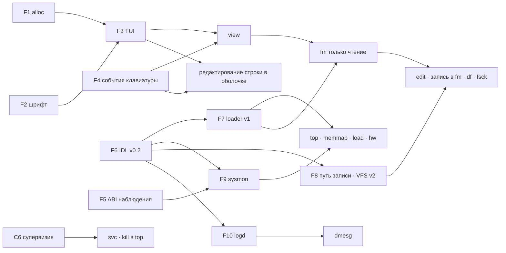

# Системные утилиты — план

**Версия:** 0.1 (2026-10-04) · **Дорожная карта:** [трек G](../../ROADMAP_RU.md) (пользовательские службы), с зависимостями от C6–C8 · **Конституция:** [v1.6](../../constitution/RU/MIND_CORE_Constitution_v1.6.md) MC-1.1, 2.3, 2.6, 3.3, 3.7, 3.11, 4, 5.4, 5.5, 10.2, 10.3, 10.6, Б.6 · **Английская версия:** [README.md](README.md) (поддерживается синхронно; эталон — английский текст)

Статус всего, что ниже: **план**. Ничего из этого ещё не реализовано; каждый пункт становится задачей в [`issues/`](../../issues/README.md), когда по нему начинается работа.

В MIND CORE есть командная оболочка и демонстрационные программы, но нет инструментов для работы с файлами и наблюдения за системой. Этот документ

1. перечисляет утилиты, нужные системе: три запрошенные — полноэкранный панельный текстовый редактор, двухпанельный файловый менеджер, `top` — и остальные, которые следуют из того, что в системе уже есть (карта памяти, монитор загрузки, устройства, службы, capabilities, IPC, журналы, диски);
2. называет основу, которой этим утилитам сегодня не хватает, и как её построить, не нарушая Конституцию;
3. делит работу на фазы с критериями завершения и привязывает их к дорожной карте.

## 1. На что утилиты могут опереться сегодня

| Область | Что есть | Что ограничивает утилиты |
|---|---|---|
| Экран | У каждого приложения свой экранный буфер; `compositor` копирует буфер задачи в фокусе во framebuffer; `mind::gfx::Screen` рисует пиксели и текст шрифтом 8×8 | В шрифте (`common/font.rs`) 64 глифа, ASCII 32–95: нет строчных (рисуются прописными), нет кириллицы, нет псевдографики. Цвета предполагают BGR ([задача 009](../../issues-done/009-gop-pixel-format.done)) |
| Клавиатура | `ps2_kbd` → `INPUT_EVENT` → задача в фокусе читает байты через `READ_KEY` | Приложение получает в одном потоке байтов то сырые make-коды PS/2, то сырые байты UART (0x1E — это и скан-код «A», и байт UART 0x1E). Клавиши с префиксом E0 — стрелки, Home/End, PgUp/PgDn, Ins/Del — драйвер отбрасывает. Нет отпускания клавиш, модификаторов, раскладок. Ctrl+Z — системная клавиша внимания |
| Память программ | Блоки страниц `Pages` (`ALLOC`/`FREE`), 32 блока и 16 МиБ на задачу | Нет распределителя мельче страницы, поэтому программам недоступен `alloc` (`Vec`, `String`) |
| Файлы | `vfs_server`: FAT12/16/32, `OPEN`/`READ`/`LIST`/`STAT`, длинные имена, подкаталоги | Только чтение; в блочном протоколе нет записи; символы длинных имён ≥ 0x80 превращаются в `?`; один том; глобальные пути; `LIST` не отдаёт время и атрибуты |
| Запуск программ | `loader` запускает приложение с фиксированным набором прав (rtc, vfs, audio, loader, tts, по желанию endpoint в слоте INIT) и всегда с экраном | Утилите нельзя выдать при запуске дополнительную capability (сведения о системе, файл на запись, управление службами) |
| Наблюдение | `TASK_LIST` (PID, имя, состояние, CPU, запуски, тики, системные вызовы), `CPU_INFO` (тики по процессорам), `KERNEL_HEAP` (занято/свободно), `FAULTS` | Всё это требует привилегии управления процессами, которая есть только у оболочки и заодно разрешает kill, фокус, останов и чтение журналов. Нет памяти по задачам, времени простоя, счётчиков IRQ и IPC, карты адресного пространства. Загрузчик выбрасывает карту памяти UEFI после `exit_boot_services` |
| Интерфейсы | MIND IDL v0 ([docs/idl](../idl/README.md)) | Два слова и одна capability на сообщение: нет строк, записей и списков |
| Оболочка | `ps`, `cpus`, `faults`, `heap`, `clock`, `logs`, `list`, `run`/`fg`/`kill` | Нет редактирования строки и истории; вывод программы в фокусе дублируется только в COM1 |
| Пределы | Всего 20 задач, из них 8 приложений; арена ядра 64 МиБ; каждый экран — полный кадр в этой арене | Две новые службы (ниже) займут 2 из 20 слотов задач; несколько утилит с экранами одновременно стоят нескольких кадров памяти ядра |

## 2. Каталог утилит

Приоритет: **P0** — запрошено или нужно запрошенной утилите; **P1** — следующее; **P2** — позже или после других треков.

### 2.1 Файлы и текст

| Утилита | Назначение | Что нужно (данные, права) | Приоритет |
|---|---|---|---|
| `fm` | Двухпанельный файловый менеджер в стиле Norton Commander / FAR | Handles каталогов: только чтение для `/`, чтение и запись для каталога данных пользователя; loader (запуск программы, открытие редактора) | P0 |
| `edit` | Полноэкранный панельный текстовый редактор (в стиле mcedit / редактора FAR) | Один handle файла, выданный при запуске (на запись или только чтение) | P0 |
| `view` | Просмотрщик текста и hex; тот же код — F3 в `fm` | Handle файла только для чтения | P0 — первая утилита, которая работает на сегодняшней VFS только для чтения |
| `df`, `fsck` | Тома, размер и свободное место; проверка целостности FAT без записи | Сведения о томе от VFS | P1 (`fsck` — ещё и тестовый оракул для записи FAT) |
| `find`, `grep` | Поиск по имени и содержимому: в `fm` (Alt+F7) и как консольные утилиты | Handle каталога только для чтения | P2 — сделано в задаче 082 (`search/`, `mind::pattern`) |
| `format` | Создать том FAT на RAM-диске или разделе данных | Право записи на выбранное блочное устройство, явное подтверждение | P2 — для RAM-диска сделано в задаче 083 (`format` в `vfs.wit` 2.3; подтверждение — `-y`) |

### 2.2 Наблюдение

| Утилита | Назначение | Что нужно | Приоритет |
|---|---|---|---|
| `top` | Задачи и загрузка CPU, интерактивно: сортировка, дерево по запускающим, подробности | `sysinfo` (§3, F5, F9) | P0 |
| `memmap` | Карта памяти: физическая раскладка, арена ядра, адресное пространство процесса, квоты | `sysinfo` | P0 |
| `load` | Монитор загрузки: CPU по ядрам, прерывания, системные вызовы, IPC, память во времени; средняя загрузка | История `sysinfo` | P0 |
| `hw` | Процессоры, часы, режим framebuffer, устройства PCI и служба, которая держит каждое, линии IRQ, области DMA, блочные и звуковые устройства | `sysinfo` | P1 |
| `ipc` | Endpoints, кто их обслуживает и кто держит, глубина очереди, заблокированные задачи, граф ожиданий с подсветкой циклов | `sysinfo` | P1 |
| `caps` | Capabilities задачи (вид, права, поколение, диапазон, родитель в дереве производных); дерево производных; что удалит отзыв | `sysinfo` с более сильным правом (граф полномочий — чувствительные сведения) | P1 |
| `dmesg` | Системный журнал: загрузка, init, службы, отказы — с источником и временем | `logd` (F10) | P1 |
| `uptime`, `free`, `date` | Однострочные сводки в консоли | `sysinfo`, `rtc` | P2 |

### 2.3 Службы и управление

| Утилита | Назначение | Что нужно | Приоритет |
|---|---|---|---|
| `svc` | Загрузочные службы: состояние, PID, перезапуски, удерживаемые устройства; запуск, останов, перезапуск | Интерфейс жизненного цикла `init` (C6 дорожной карты) | P1 |
| `reboot` | Перезагрузка со сбросом файловых систем на диск (`stop` уже останавливает систему) | Управление процессами, flush VFS | P2 |
| `keymap` | Раскладка клавиатуры (английская, русская) и клавиша переключения | Настройки ввода | P2 |
| `screenshot` | Сохранить экран в BMP | Право чтения экрана у `compositor`, handle файла | P2 |

### 2.4 Оболочка как средство запуска

Редактирование строки (стрелки, Home/End, Del), история, дополнение имён программ и путей, строчные буквы и кириллица на экране, прокрутка назад и **консольные программы**: программа, запущенная без экрана, остаётся на переднем плане оболочки, а её консольный вывод рисуется в оболочке. Так `uptime`, `df`, `dmesg`, `find` становятся простыми консольными утилитами. Редактирование строки — P0 (ему нужны те же события клавиатуры, что и редактору), остальное — P1.

## 3. Основа

Десять строительных блоков; утилиты из §4 — тонкий слой над ними.

| ID | Блок | Где | Объём | Когда можно начать |
|---|---|---|---|---|
| F1 | Куча программ `mind::alloc` | `libmind` | S–M | Сейчас |
| F2 | Шрифт 8×16 с кириллицей и псевдографикой | `common/`, `scripts/` | S | Сейчас |
| F3 | Библиотека текстового интерфейса `mind::tui` | `libmind` | M | После F1, F2 |
| F4 | События клавиатуры | `ps2_kbd`, `shell`, ядро, `libmind` | M | Сейчас (часть в ядре — по согласованию) |
| F5 | ABI наблюдения | ядро, `common/abi.rs`, загрузчик | M–L | Вместе с ответственным за ядро, рядом с C6/C7 |
| F6 | MIND IDL v0.2: записи, строки и списки в буфере | `scripts/mind_idl.py`, `libmind/src/idl` | M | Сейчас |
| F7 | Запуск с выданными capabilities | `loader`, `shell`, `libmind` | M | После F6 |
| F8 | Путь записи: запись на блочные устройства, RAM-диск, VFS v2 с handles каталогов | драйверы, `vfs_server`, ядро (badges) | L | После F6; часть VFS — это её перенос по C8 |
| F9 | Служба `sysmon` | новая служба | M | После F5, F6 |
| F10 | Служба `logd` | новая служба | S–M | После F6 |

### F1. Куча программ

- `GlobalAlloc` в `libmind` за cargo-фичей `alloc`: классы размеров 16 Б – 2 КиБ в slab-ах по 64 КиБ, крупные выделения — отдельными блоками страниц. Арены растут шагами по 1 МиБ, чтобы мелкие блоки не исчерпали пределы задачи (32 блока, 16 МиБ). При нехватке памяти возвращается null; `handle_alloc_error` пишет в журнал и завершает задачу.
- Службы фичу не включают и остаются на статической памяти, их потребление остаётся фиксированным (MC-5.1).
- Тесты на хосте с имитацией источника страниц.

### F2. Шрифт

- Растровый 8×16: ASCII, Latin-1, кириллица U+0400–U+045F (с Ё/ё), псевдографика U+2500–U+257F (как минимум одинарные и двойные линии панелей), блочные элементы U+2580–U+259F (полосы и графики), стрелки, «», —, №, … — около 450 глифов, ~7 КиБ.
- Источник — готовый шрифт BDF, лицензия и покрытие которого подтверждены и записаны рядом с данными, как для словарей синтеза речи (кандидат: Terminus, SIL OFL 1.1). `scripts/font_gen.py` превращает его в сгенерированный и закоммиченный `common/font16.rs`; тест падает, если файл устарел (как `tests/idl_test.py` для привязок IDL).
- Поиск — по отсортированной таблице кодовых точек (двоичный поиск, как в словарях синтеза речи); для неизвестных символов — глиф замены. Шрифт 8×8 остаётся для существующих демонстраций.
- Размер сетки: 800×600 → 100×37 знакомест, 1024×768 → 128×48, 1280×800 → 160×50. Фиксированный целевой режим в загрузчике ([задача 009](../../issues-done/009-gop-pixel-format.done)) делает раскладку предсказуемой.

### F3. Библиотека текстового интерфейса

- Сетка знакомест (символ, цвет текста, цвет фона, атрибуты), задний буфер и сравнение: в `Screen` рисуются только изменившиеся знакоместа. Курсор, палитры (классическая синяя в духе Norton и тёмная).
- Виджеты: рамка, прокручиваемый список с выделением (панель), таблица со столбцами и сортировкой, строка меню с выпадающими меню, диалоги (сообщение, подтверждение, ввод), строка ввода с редактированием и историей, строка состояния и полоса F-клавиш, индикатор выполнения, шкала, график временного ряда из блочных элементов.
- Цикл событий: ожидание события клавиатуры или таймаута (`WAIT` уже просыпается раньше при вводе).
- Тестируется на хосте: отрисовка в сетку в памяти, тесты сравнивают сетки.
- Возможно позже (трек G): композитор просматривает весь экран на каждом изменённом кадре; подсказка о прямоугольнике изменений сократила бы эту работу для текстовых утилит.

### F4. События клавиатуры

- Один формат событий для всех путей ввода: `KeyEvent { key, mods, ch, pressed }`, упакованный в одно слово, — коды клавиш для печатных символов, Enter, Esc, Tab, Backspace, стрелок, Home/End, PgUp/PgDn, Ins/Del, F1–F12; Shift/Ctrl/Alt; символ по активной раскладке; нажатие или отпускание.
- Ядро (только механизм, MC-1.1): очередь ввода задачи хранит события вместо байтов (64 записи), `INPUT_EVENT` принимает слово события, новый `READ_INPUT` его возвращает. `READ_KEY` остаётся для существующих программ, пока их не перевели. Флаг внимания (Ctrl+Z) не меняется. Ни декодирования, ни раскладок в ядре.
- `ps2_kbd`: префикс E0, коды отпускания, состояние модификаторов, Caps Lock, раскладки US и русская ЙЦУКЕН с клавишей переключения (политика раскладок живёт в ring 3; позже — служба методов ввода, трек G).
- Оболочка (она владеет COM1): декодер последовательностей VT100/xterm (`ESC [ A`–`D`, `ESC [ H`/`F`, `ESC [ n ~`, `ESC O P`–`S`) с таймаутом 50 мс, чтобы отличать одиночный Esc от последовательности; UTF-8 из UART уже принимается.
- `mind::input`: `read_event()`, `wait_event(ms)`; `wait_or_exit` продолжает работать.
- Зарезервированная клавиша: Ctrl+Z — системная клавиша внимания, ни одна утилита не может её использовать (отмена в редакторе — Ctrl+U и Alt+Backspace).

### F5. ABI наблюдения

- **Разделение привилегий.** Новый вид привилегии `CAP_KIND_OBSERVE` (статистика только для чтения). `TASK_LIST`, `CPU_INFO`, `KERNEL_HEAP`, `FAULTS` и новый `STAT` принимают OBSERVE или CONTROL; kill, фокус, останов, журналы и консольный вывод остаются только за CONTROL — читать вывод чужой задачи значит читать её данные (MC-10.2). `init` выпускает OBSERVE только для `sysmon`.
- **Один системный вызов** `STAT(class, buffer, capacity, argument)`, возвращающий версионированные записи фиксированного размера (`StatHeader { version, record_size, count, total }`). Копирование идёт под блокировкой планировщика и ограничено размерами таблиц (20 задач, 64 endpoints, 32 слота, 16 линий IRQ), поэтому у непрерываемого участка есть граница (MC-5.4).
- **Классы:**
  - `TASKS`: PID, PID запустившего, имя, состояние и что задача ждёт (send/receive/call на endpoint *k*, ответ, сон, IRQ), CPU, запуски, тики, время исполнения в нс, системные вызовы, отправки и приёмы IPC, байты и блоки частной кучи, байты разделяемых отображений, байты образа/стека/экрана, занятые слоты capabilities, использование квот задач и endpoints и их пределы, время запуска.
  - `CPUS`: APIC id, в сети ли, тики таймера, нс занятости, нс простоя, прерывания, IPI, переключения контекста, текущий PID.
  - `MEMORY`: размер арены ядра, занято, свободно, наибольший свободный блок, число свободных фрагментов; байты по категориям (образы задач, стеки, контексты, экраны, частные кучи, объекты памяти, удерживаемые «сироты», DMA); общие пределы (DMA 8 МиБ, объекты памяти 16 МиБ).
  - `PHYSMAP`: карта памяти прошивки (тип, начало, страницы) и известная ядру раскладка платформы: образ ядра, арена кучи, загрузочные образы, framebuffer, трамплин AP, BAR устройств PCI.
  - `VMAP(pid)`: области адресного пространства: начало, размер, вид (код, данные, стек, защитная страница, экран, информационная страница, почтовый ящик, блок кучи, разделяемое отображение, регистры устройства), права R/W/X, частная/разделяемая/устройство.
  - `CAPS(pid)`: слот, поколение, вид, права, размер или диапазон портов, узел и родитель в дереве производных.
  - `ENDPOINTS`: для каждого живого endpoint — индекс наблюдения, создатель, держатели права приёма, ожидающие отправители, ожидающие ответы, отказы `ERR_BUSY`, таймауты.
  - `IRQS`, `DEVICES`: линия → держатель привязки, счётчик, замаскирована ли; устройства PCI с классом, размерами BAR, IRQ и держателем capability каждого BAR.
- **Никогда не отдаётся** (MC-10.2): содержимое памяти любой задачи; физические адреса памяти задач (физические адреса — только для раскладки платформы); ничего, что можно использовать как полномочие, — индекс наблюдения endpoint — это метка, которую не принимает ни один системный вызов, поэтому это не неявное имя (MC-3.3).
- **Учёт, который нужно добавить в ядро:** отметка TSC при каждом переключении контекста (нс исполнения по задачам, нс занятости и простоя по процессорам — сейчас есть только счётчики тиков по 10 мс); счётчики по линиям IRQ и по endpoints; счётчики арены ядра по категориям, обновляемые там, где создаётся и освобождается `Region`.
- **Загрузчик:** скопировать карту памяти, которую возвращает `exit_boot_services`, в страницы передачи и передать её в `BootInfo` (изменение ABI: пересобираются все компоненты).

### F6. MIND IDL v0.2

- Утилитам нужны текст и таблицы (пути, записи каталогов, таблицы задач); v0 переносит два слова.
- Добавить `record`, `string` и `list<record>` с объявленными максимальными размерами, размещаемые в буфере памяти, передаваемом с вызовом: `borrow<memory>` для результатов, которые заполняет сервер, запечатанная память только для чтения для входных данных (SHARE_RO, MC-2.6). Два слова несут метод, версию и длины. Генератор выпускает кодировщики и декодеры с проверкой границ; получатель отвергает некорректные буферы (MC-2.4).
- Интерфейсы, которые на нём пишутся: `sysinfo.wit`, `vfs.wit` (VFS v2), `loader.wit`, `log.wit`, `lifecycle.wit` (вместе с C6; после слияния с `main` запросы жизненного цикла входят в `init.wit` 1.1), `rtc.wit` 1.1 (добавляет `date`, нужную для времени файлов; новая функция в конце — это младшая версия).

### F7. Запуск с выданными capabilities

- Сейчас каждое приложение получает один и тот же набор; утилитам нужно больше (клиент sysinfo, handle файла, управление жизненным циклом). Выдача прав по имени программы нарушила бы MC-3.7.
- Выдаёт вызывающий, программа только запрашивает (MC-3.11):
  - **Loader v1** (`loader.wit`): `begin(name, args) → session`, `grant(session, slot, capability)` — повторяется, по одной capability на сообщение IPC, `commit(session) → pid`, `abort(session)`, `inspect(name) → needs`. Loader копирует только то, что передал вызывающий (слот 1 для пары ping/pong и фиксированные слоты 7, 10–12 из issue 072); запрос программы выбирает программу с экраном или консольную. Сделано в issue 062; после слияния с `main` это `loader.wit` 1.1 на IDL из `main`, а прежний переходник «запуск с endpoint» удалён.
  - **Запрос:** note-секция `.note.mind.request` в ELF перечисляет, что программа просит (`sysinfo`, `file:rw`, `dir:rw`, `lifecycle`), и нужен ли ей экран; `inspect(name)` возвращает это вызывающему, а решает он.
  - Для файлов сделано в issue 071: `REQUEST_FILE` получает клиент `vfs_server`, ограниченный каталогом названного файла, `REQUEST_FILES` — весь клиент пользователя (fm).
  - **Оболочка как агент пользователя (powerbox):** `edit notes.txt` → оболочка открывает `notes.txt` на запись и передаёт только этот handle; `fm` → handle `/` только для чтения и handle каталога данных на запись; `top`, `memmap`, `load` → клиент sysinfo. Остальное из запроса отклоняется или подтверждается пользователем.
  - Позже note-секцию заменят подписанные манифесты (трек C, статья 9).

### F8. Путь записи

- **Конституция.** Носители FAT и USB — внешние; запись идёт отдельным путём с отдельными правами (приложение Б.6); постоянное собственное хранилище — трек B (статья 4). Поэтому запись FAT — путь экспорта и совместимости, заявленный в профиле именно так, а не собственное хранилище системы.
- **Отдельное право записи на блочные устройства.** Два варианта: (а) второй endpoint у каждого драйвера (`block.rw`), который `init` выдаёт только `vfs_server`; (б) **badges endpoints**: `CAP_MINT` ставит метку (badge), `IPC_RECV` сообщает метку capability, через которую пришёл отправитель, и один endpoint различает клиентов только для чтения и на запись (как в seL4). Вариант (б) — небольшой общий механизм ядра, который нужен также `vfs_server` и `sysmon`; рекомендуется, отдельной задачей.
- **Блочный протокол:** `write` и `flush` (`block.wit` 1.1); данные приходят в драйвер как запечатанная память только для чтения, поэтому он пишет ровно то, что было проверено.
  - `ata`: WRITE SECTORS (0x30, PIO), FLUSH CACHE (0xE7);
  - `ahci`: WRITE DMA EXT (0x35), FLUSH CACHE EXT (0xEA);
  - `usb_storage`: SCSI WRITE(10) (0x2A), SYNCHRONIZE CACHE(10) (0x35), защита от записи по MODE SENSE.
- **`ramdisk`** (новая блочная служба): устройство в памяти размером по политике `init`, размечается FAT при первом использовании. Это `/tmp` и цель всех тестов записи, поэтому запись FAT разрабатывается, не трогая загрузочный диск. Сделано в issue 065 (8 МиБ, константа службы; `vfs_server` размечает его FAT16, если он пуст, и монтирует как `ram:`).
- **`vfs_server` v2** на `vfs.wit` — это и есть перенос VFS по C8, выполняемый один раз:
  - **handles каталогов** вместо глобальных путей: `open_dir(handle, path, rights)`; пути относительные, `..` выше корня handle отвергается; права «только чтение»/«чтение и запись» ослабляются (MC-3.4). Handle поддерева — то, что оболочка выдаёт утилите;
  - операции: create, write, truncate, rename, remove, mkdir, rmdir, stat (размер, атрибуты, время изменения), list с атрибутами и временем, сведения о томе (тип, размер, свободно), flush;
  - FAT: выделение и освобождение кластеров для FAT12/16/32, все копии FAT, счётчик свободных в FSInfo, длинные имена с контрольной суммой и уникальным коротким псевдонимом, UTF-16 ↔ UTF-8 (кириллические имена, сейчас показываются как `?`), время файлов по дате RTC, рост каталогов, фиксированный корневой каталог FAT12/16 («каталог заполнен»), бит «том не закрыт» в FAT[1], устанавливаемый при первой записи и снимаемый при flush;
  - порядок записи: данные → FAT → запись каталога, с записанным исходом потери питания на каждом шаге (MC-12.3: атомарности сверх той, что даёт FAT, не заявляется);
  - несколько именованных томов (загрузочный диск, RAM-диск);
  - один писатель на файл; читатели видят размер на момент последнего flush;
  - загрузочный набор защищён политикой: `init` выдаёт handles на запись только ниже каталога данных (например, `/data`), никогда — для `EFI/`, `kernel.elf` и образов служб.
  - Сделано в issue 066: `idl/vfs.wit` 2.0 (2.2 после слияния с `main`: списки страницами по 16 записей, чтение и запись до 16 КиБ); зона корневого handle задаётся badge клиента (приложения только читают, `VFS_BADGE_USER` оболочки пишет на `ram:` и ниже `data/`); счётчик свободных кластеров в FSInfo при первом изменении помечается неизвестным, а не поддерживается.
- **Сохранение в редакторе:** записать `name.tmp`, flush, переименовать поверх `name` (в одном каталоге это замена одной записи каталога; на FAT — по возможности, так и заявляется).
- **Тесты:** виртуальный FAT-диск QEMU (`fat:rw:`) плохо подходит для тестов записи; запись проверяется на RAM-диске и на сыром образе FAT, подключённом вторым диском, а после прогона `fsck.fat -n` на хосте проверяет образ.

### F9. `sysmon`

- Служба, которая держит OBSERVE (от `init`) и обслуживает `sysinfo.wit`: снимки всех классов `STAT` и история — отсчёты каждые 100 мс (последние 300) и каждую секунду (последние 600) занятости по процессорам, прерываний, системных вызовов, IPC, переключений контекста, памяти и числа задач; средняя загрузка за 1/5/15 минут (скользящее среднее числа готовых и исполняемых задач).
- Почему служба, а не привилегия в каждой утилите: история есть сразу при открытии утилиты; одно место для ограничения частоты запросов каждого клиента (квоты MC-10.2; MC-5.5 — диагностика работает с фиксированным периодом в заранее выделенных буферах и не съедает чужие резервы); фильтрация по праву клиента (badge), например вид `caps` только для более сильного клиента; утилиты зависят от контракта IDL, а не от раскладки записей ядра.

### F10. `logd`

- Ограниченное кольцо (64 КиБ) записей: монотонное время, PID и имя источника, проставленные сервером по отправителю IPC (а не взятые из сообщения, — происхождение, MC-10.6), уровень, текст до 200 байт. При заполнении старые записи уходят, а пропуск подсчитывается (обнаружение пропусков, MC-10.6).
- Пишут `init` и службы; читает `dmesg`. Отказы ядра приходят через `sysmon` (`FAULTS`); ядро по-прежнему пишет в COM1 только строку загрузки и паники.
- Позже — журнал аудита изменений полномочий (MC-10.3).
- Сделано в issue 069 (`logd/`, `idl/log.wit`, `dmesg/`): 256 фиксированных ячеек по 256 байт, порядковые номера для обнаружения пропусков, счётчик вытесненных записей и ограничение 64 записи в секунду на отправителя (отклонённые записи считаются и отмечаются в журнале, MC-10.2); имя берётся из записей ядра о задачах через привилегию наблюдения. Службы не вызывают отдельный API: каждая строка `println!` процесса, у которого есть клиент `logd` (слот 12), уходит в `logd`, поэтому прежние сообщения служб попали в журнал без изменений; строки `init`, напечатанные до запуска `logd`, сохраняются и отправляются потом. Отступления: отказы ядра пока не копируются в журнал (их показывают `faults` и `sysmon`); время записи — время её получения.

## 4. Утилиты

### 4.1 `fm` — файловый менеджер

- **Экран:** две панели, командная/информационная строка, полоса F-клавиш. Режимы панели: краткий (имена в столбцах), полный (имя, размер, дата, атрибуты), информационный (тип тома, размер, свободно; текущий файл), быстрый просмотр (начало файла под курсором в другой панели). Сортировка по имени, расширению, размеру, времени; показ скрытых файлов.
- **Клавиши (Norton Commander / FAR):** Tab — другая панель; Enter — войти в каталог, запустить `.elf` (через loader со стандартными правами) или просмотреть текст; F3 просмотр; F4 правка (запускает `edit` с handle этого файла на запись); F5 копирование; F6 перенос/переименование; F7 создать каталог; F8 удалить; F9 меню; F10 выход; Ins — выделить; `+`/`-` — выделение по маске; Alt+F1/Alt+F2 — том для левой/правой панели; Ctrl+R — перечитать; Alt+F7 — поиск.
- **Операции:** диалог хода выполнения с отменой; при ошибке — повторить / пропустить / прервать; подтверждение удаления и перезаписи; копирование между томами (загрузочный диск ↔ RAM-диск).
- **Фаза 1** (VFS только для чтения): обзор, просмотр, запуск, сведения, поиск. **Фаза 2** (после F8): операции записи.
- Фаза 1 сделана в issue 063, фаза 2 — в issue 068: F5–F8 — задания, спланированные заранее и выполняемые порциями между клавишами (ход выполнения, Esc, Повторить / Пропустить / Прервать, перезапись или пропуск существующих целей), оба тома; F4 — встроенный редактор (библиотека `edit`), а не отдельная программа — как и просмотрщик, он экономит экран. fm получает клиент VFS оболочки через `REQUEST_FILES` (issue 071 отделил его от `REQUEST_FILE` редактора, ограниченного одним каталогом).
- Просмотрщик встроен, а не запускается отдельным процессом: каждое приложение с экраном стоит полного кадра памяти ядра.
- **Командная строка** (issue 097): набираемое попадает в строку под панелями (`A:/docs> …`); Enter выполняет её — `cd <каталог>` (`..`, `/`, `ram:`; `cd` без аргумента — корень тома), `edit <файл>` (отсутствующий — новый), `view <файл>` или программа с аргументами, где имя элемента активной панели превращается в его путь (`grep -i x notes.txt` → `docs/notes.txt`); Esc очищает строку, Alt+Enter или Ctrl+Enter добавляет имя под курсором. В пустой строке `+ - *` по-прежнему выделяют. Запущенные отсюда программы получают из того, о чём просят, то, что держит fm: файлы пользователя и сведения о системе (без клиентов сети, управления службами и журнала). Если fm работает в окне `wm`, программа получает и его клиент окон и открывается в своём окне впереди (задача 099); на полном экране она работает в фоне, потому что fm не может вывести её вперёд (Ctrl+Z, затем `FG <pid>`; задача ядра 160), а вывод консольной программы fm не показывает (это делает `LOGS <pid>`).
- **Скрытие панелей** (как в Midnight / Norton Commander): Ctrl+O прячет или показывает обе, Ctrl+F1 / Ctrl+F2 — левую / правую, Ctrl+P — другую; на их месте виден вывод командной строки, а скрытая панель не держит курсор.

### 4.2 `edit` — панельный текстовый редактор

- **Буфер:** piece table (исходный файл только для чтения плюс буфер добавлений) с индексом строк: большие файлы открываются дёшево, отмена проста. Первый предел — 8 МиБ на файл (куча задачи 16 МиБ).
- **Экран:** строка меню (F9), область текста, строка состояния (имя файла, строка:столбец, изменён, INS/OVR, UTF-8, LF/CRLF; выделенное READ-ONLY для файла, который нельзя менять), полоса F-клавиш — пока нажат Shift, Ctrl или Alt, она показывает, что делают F1–F10 с ним (Shift+F2 сохранить как, Shift+F7 дальше, Ctrl+F7 замена, Alt+F8 перейти к строке), как в `fm` и `view`.
- **Клавиши:** стрелки, Home/End, PgUp/PgDn, Ctrl+Home/End, Ctrl+←/→ по словам, Shift + перемещение выделяет, Ctrl+C/X/V (буфер обмена редактора; системный — позже), Del/Backspace, Tab, F2 сохранить, Shift+F2 сохранить как (нужен handle каталога), F7 поиск, Ctrl+F7 замена, Alt+F8 перейти к строке, F10 выход с диалогом о несохранённых изменениях; отмена Ctrl+U / Alt+Backspace, повтор Ctrl+Y.
- **Текст:** UTF-8 (русский и английский), окончания строк сохраняются, ширина табуляции 4 или 8, некорректный UTF-8 показывается глифом замены и сохраняется байт в байт.
- **Режимы:** только чтение (открыт с handle только для чтения; редактор сразу говорит об этом в нижней строке и повторяет при любой клавише, которая изменила бы текст) и hex (общий с `view`).
- **Позже:** подсветка синтаксиса (Rust, TOML, WIT, Markdown), выделение столбцом.
- Ядро редактора (буфер, курсор, поиск, отмена) — модуль `no_std`, который собирается и на хосте и там же тестируется, как `tests/tts_host.rs`.
- Сделано в issue 067 (`edit/`, `tests/edit_host.rs`, набор QEMU `edit`). С issue 071 редактор получает клиент VFS, ограниченный каталогом своего файла (`scope` в `vfs.wit`), а не handle одного файла: сохранению через `name.tmp` и переименование нужен каталог. Отступление: режима hex пока нет (есть `view`).

### 4.3 `view` — просмотрщик

Текст (перенос строк вкл./выкл., поиск, переход к смещению, UTF-8) и hex (смещение, 16 байт в строке, столбец символов). Большие файлы читаются по требованию по смещению (`VFS READ` уже принимает смещение) и никогда не загружаются целиком. Доступен как `view <файл>`, как F3 в `fm` и внутри `edit`. Работает на сегодняшней VFS только для чтения, поэтому это первое видимое подтверждение F1–F4.

### 4.4 `top`

- **Заголовок:** время работы; задачи исполняются / готовы / спят / заблокированы; полоса занятости для каждого процессора; средняя загрузка; память ядра занято/свободно; IPC в секунду; отказы с момента загрузки.
- **Таблица:** PID, PPID, NAME, STATE (RUN, READY, SLEEP, SEND, RECV, CALL, IRQ, EXIT), CPU, %CPU, TIME, SYSC/s, HEAP, SHARED, CAPS, EP; службы помечены.
- **Клавиши:** P/M/N/T — сортировка по CPU, памяти, PID, времени; S — скрыть службы; t — дерево по запускающим; Enter — подробности задачи (сводка адресного пространства, capabilities, чего она ждёт); k — kill и r — перезапуск через интерфейс жизненного цикла `init` (C6) — до C6 клавиша показывает «используйте KILL в оболочке»; `+`/`-` — период обновления; q или Esc — выход.
- %CPU считается по приращениям времени исполнения в нс (F5); без них — по приращениям тиков, с указанием на экране разрешения 10 мс.

### 4.5 `memmap` — карта памяти

Четыре вида (Tab):

1. **Физическая память:** полоса адресного пространства (0–4 ГиБ и выше, если есть), раскрашенная по типам — свободная RAM, данные загрузчика, образ ядра, арена кучи, загрузочные образы, framebuffer, ACPI, MMIO, зарезервированное, — и список диапазонов с размерами.
2. **Арена ядра (64 МиБ):** занято, свободно, наибольший свободный блок, число свободных фрагментов (фрагментация объясняет отказы непрерывных выделений — память программ сейчас физически непрерывна), байты по категориям, пределы DMA (8 МиБ) и объектов памяти (16 МиБ).
3. **Процесс (pmap):** выбрать PID → его области от `USER_IMAGE`: код (RX), данные (RW, NX), стек с защитными страницами, экран, информационная страница, почтовый ящик, блоки кучи с защитными страницами, разделяемые отображения (только чтение или запись, и от кого), регистры устройств; итоги против пределов (куча 16 МиБ / 32 блока, разделяемые 48 МиБ).
4. **Квоты:** квоты задач и endpoints по владельцам, деревом по запускающим.

Содержимое памяти и физические адреса страниц задач не показываются.

### 4.6 `load` — монитор загрузки

Графики за последние 30 с (отсчёты по 100 мс) или 10 мин (отсчёты по 1 с): занятость CPU по ядрам (строка на ядро или накопительно), прерывания в секунду по линиям, системные вызовы в секунду, сообщения IPC в секунду, переключения контекста в секунду, занятость арены ядра, число живых задач. Средняя загрузка за 1/5/15 мин. Клавиши: `1`/`2` — окно, `c` — по процессорам / суммарно. `uptime` печатает ту же сводку одной строкой.

### 4.7 Остальные кратко

- **`hw`:** производитель и модель CPU (CPUID), важные здесь возможности (NX, инвариантный TSC, xAPIC), частота TSC и разрешение часов; режим framebuffer, stride и формат пикселя; устройства PCI с названиями классов и службой, которая держит каждое; линии IRQ и их держатели; области DMA и их держатели; блочные устройства (вид, размер, модель из IDENTIFY / INQUIRY); звуковое устройство.
- **`ipc`:** endpoints с сервером и клиентами по PID, глубина очереди (из `ENDPOINT_QUEUE` = 8), ожидающие отправители, сохранённые ответы, счётчики таймаутов и `ERR_BUSY`; граф ожиданий (задача → endpoint → сервер) с подсветкой циклов как взаимоблокировок. Сделано в задаче 080 (`monitor/src/ipc.rs`; `holders` в `sysinfo.wit` 2.1, `sysmon` собирает их из `STAT_CAPS`); предел очереди в `main` — `ENDPOINT_QUEUE` = 4. Отступление: сохранённые ответы не считаются (в `STAT` нет такого поля).
- **`caps`:** слоты задачи с handle и поколением, вид, права, диапазон, родитель в дереве производных; дерево производных между задачами; «что удалит отзыв этой capability». Требует права сильнее обычного наблюдения. Сделано в задаче 081 (`monitor/src/caps.rs`): `authority` из `sysinfo.wit` 3.0 (capabilities всех задач с узлом и родителем, постранично) отвечает только клиенту, чья capability несёт `mind::stat::BADGE_AUTHORITY`; оболочка одалживает свой клиент из слота 13 в `SLOT_SYSINFO` программе, которая просит `REQUEST_AUTHORITY`. То же право теперь закрывает `holders` (поэтому `ipc` тоже его просит) и связи производных в `caps(pid)`: обычный наблюдатель получает там 0.
- **`dmesg`:** фильтр по источнику и уровню, режим слежения.
- **`svc`:** службы от `init`: PID, состояние, перезапуски, удерживаемые устройства; запуск, останов, перезапуск; бюджеты перезапусков и поколения, когда появится C6. Сделано в issue 070: `init` обслуживает `idl/lifecycle.wit` на своём endpoint (после слияния с `main` эти запросы входят в `idl/init.wit` 1.1) (он заменил числовой запрос «запустить по имени») с привилегией управления процессами, которую создаёт для себя; оболочка одалживает свой клиент `init` по `REQUEST_LIFECYCLE`; `svc` — консольная программа, `top` останавливает задачу (k) и перезапускает службу (r) после подтверждения. «Удерживаемые устройства» — то, что выдал `init`, кратко.
- **`df` / `fsck`:** тип тома, размер кластера, размер, свободное место (из FSInfo или подсчётом по FAT); `fsck` ищет потерянные кластеры, пересекающиеся цепочки и расхождения размеров, ничего не записывая. Сделано в issue 068: `df` по `volume` (свободное место считается по FAT один раз, затем поддерживается); `fsck` — это `check` из `vfs.wit` 2.1, выполняемый `vfs_server` (только он читает секторы); он также сообщает о цепочках, упирающихся в свободный или плохой кластер, о некорректных записях и о флаге «грязного» тома.
- **`format`, `screenshot`, `keymap`, `reboot`:** как в §2. Сделаны в задачах 083 (`format`), 086 (`screenshot`: `idl/display.wit` 1.0 обслуживает `compositor`, запечатанная копия экрана только для чтения, оболочка пишет её как 24-битный BMP), 085 (`keymap`: `idl/keyboard.wit` 1.0 обслуживает `ps2_kbd`, которому IRQ 1 теперь приходит сообщением на служебный endpoint) и 084 (`reboot [-f]`: сброс кэшей, остановка служб в обратном порядке запуска через `init`, затем `REBOOT`). `screenshot` снимает экран, который впереди, — при вводе в оболочке это экран оболочки.

### 4.8 Оболочка

Редактирование строки стрелками, Home/End и Del; история (↑/↓, 32 строки); дополнение по Tab имён программ (`LIST` у loader) и путей; строчные буквы и кириллица через шрифт 8×16; прокрутка назад по Shift+PgUp/PgDn; консольные программы (§2.4).

### 4.9 `wm` — оконный менеджер (задача 088, на брокере окон задачи 157)

Приложение, а не служба: `wm fm fm clock dzen-clock` (или `wm fm data, edit ram:a.txt` с аргументами) запускает программы в окнах; Alt+R запускает ещё.
- **Окна:** на сетке ячеек собственного экрана, с рамками, заголовками, отметкой закрытия `[×]` и уголком изменения размера `◆`; переднее окно — с двойной рамкой, оно получает клавиши. Первые четыре окна занимают четверти экрана (текстовое заполняет свою четверть, пиксельное получает рамку по размеру своих пикселей), следующие — лесенкой.
- **Клавиши:** Alt+Tab / Alt+Shift+Tab — следующее / предыдущее окно; Alt+←→↑↓ — половина экрана; Alt+1…4 — четверть; Alt+Enter — развернуть или вернуть; Alt+M — перемещение (стрелки, с Ctrl по 8 ячеек) и размер (Shift+стрелки), Enter завершает, и окно в пределах двух ячеек от края прилипает (угол — четверть, сторона — половина, верх — весь экран), Esc возвращает; Alt+W или Alt+F4 — закрыть; Alt+R — запустить; Alt+H — клавиши; Alt+Q — уйти; Alt+X — закрыть всё. Остальные клавиши получает только переднее окно; Shift, Ctrl и Alt переднее окно видит нажатыми, остальные — отпущенными.
- **Мышь** (PS/2, задача 156): щелчок выводит окно вперёд; перетаскивание заголовка двигает окно, и оно прилипает, когда кнопку отпускают; перетаскивание `◆` меняет размер; `[×]` закрывает.
- **Содержимое:** текст — `mind::tui::Terminal::open` рисует в поверхность ячеек размером с внутренность окна и перерисовывает при его изменении; пиксели — `mind::windowed::pixels` даёт программе кадровый буфер в окне (`clock` 320 × 176, `dzen-clock` 400 × 320), рисуемый поверх ячеек (`wm` копирует только видимые ячейки). `mind::input` читает клавиши, которые `wm` кладёт в поверхность, а `mind::time::sleep` ждёт на endpoint пробуждения окна, поэтому `fm`, `edit`, `view`, `top`, `memmap`, `load`, `hw`, `ipc`, `caps`, `keys`, `clock` и `dzen-clock` работают в окнах с одной изменённой строкой. Программа, запущенная в окне, не получает своего экрана (кадра памяти ядра).
- **Окна переживают менеджер.** Поверхности — память брокера; брокер хранит места, которые сохраняет `wm`. *Уход* (Alt+Q; и падение или kill): программы работают скрытыми, следующий `wm` показывает их на прежних местах. *Закрыть всё* (Alt+X): каждую программу просят завершиться (она завершается при следующем взгляде на ввод); оставшиеся через 3 с называются в журнале.
- **Права:** `wm` просит у оболочки клиент менеджера окон, файлы пользователя и сведения о системе; запущенная им программа получает простой клиент брокера и из того, о чём просит, только это (каталог файла ограничивается из клиента файлов, как это делает оболочка). `top` работает без клиента управления службами, `caps` — без представления полномочий (MC-3.11).
- `clock --text` и `dzen-clock --text` (задача 089) рисуют текстовые варианты по размеру окна: крупные цифры из блоков с датой, индикаторы — цветными ячейками.
- Программа, запущенная из `fm` в окне, открывается в своём окне (задача 099).
- Не сделано: изменение размера содержимого пиксельного окна (рамка обрезает или дополняет его); консольные программы в окнах (`uptime` и подобные остаются в оболочке); мышь внутри окон.
- Полноэкранные консоли с переключением Alt+F1…F4 — задача 155.

## 5. Фазы

| Фаза | Содержание | Зависит от | Критерии завершения (свидетельства) |
|---|---|---|---|
| **T0. Основа** | F1, F2, F3, F4, редактирование строки в оболочке, F6 | — (часть F4 в ядре — с ответственным за ядро) | Тесты на хосте: распределитель, отрисовка TUI в сетку, декодеры PS/2 set 1 и VT100. Набор QEMU `keys`: стрелки и F-клавиши из UART и из PS/2 (`sendkey`) доходят до приложения как события; `screendump` показывает кириллицу и псевдографику |
| **T1. Утилиты только для чтения** | `view`, `fm` только для чтения, F5, F9, `top`, `memmap`, `load`, `hw`, F7 | T0; F5 — рядом с работами C6/C7 в ядре | Наборы QEMU `view`, `fm`, `top`, `memmap`: числа сверяются (число задач = `ps`, занятость арены = `heap`, карта адресного пространства тестового приложения совпадает с его известной раскладкой, `busy_app` показывает ≈ 100 % на своём CPU). Отрицательный тест: OBSERVE не может убить задачу, сменить фокус или прочитать журналы |
| **T2. Запись** | badges или rw-endpoints, запись на блочные устройства, `ramdisk`, VFS v2 (перенос VFS по C8), `edit`, операции записи в `fm`, `df`, `fsck` | T1; место VFS в C8 | Хост: property-тесты записи FAT с проверкой `fsck.fat -n` и mtools. Набор QEMU `edit`: правка и сохранение файла на RAM-диске и на сыром диске FAT, повторное чтение после перезагрузки, `fsck.fat -n` без ошибок; копирование, перенос, удаление в `fm` между томами. Отрицательные тесты: handle на запись не выходит за свой каталог и не достаёт загрузочные файлы |
| **T3. Службы и полномочия** | F10 + `dmesg`, `svc`, kill/перезапуск в `top`, `ipc`, `caps` | C6 | Наборы: служба, убитая из `svc`, — её клиенты получают `ERR_PEER`, затем достают перезапущенную; `ipc` показывает намеренно созданный цикл ожиданий; `caps` совпадает с `CAP_INFO` тестового приложения; записи журнала несут проставленного сервером отправителя |
| **T4. После других треков** | бюджеты в `top` (C7), панель собственного хранилища объектов в `fm` (трек B), подписанные манифесты вместо note-секции (трек C), `netstat` (трек D), системный буфер обмена, `screenshot`, `format`, подсветка синтаксиса | C7, B, C, D | По каждому пункту |

**Порядок первых поставок:** (1) F1 + F2 + F3 + F4 → `view` — видимый результат без новых протоколов IPC; (2) редактирование строки в оболочке; (3) F5 + F6 + F9 → `top`, `memmap`, `load`; (4) F7 → `fm` только для чтения; (5) F8 → `edit` и запись в `fm`.

## 6. Согласование с дорожной картой и Конституцией

- **§5 дорожной карты** разрешает сейчас только работу, не зависящую от ABI ядра: F1–F3, декодеры F4, ядро редактора, F6. Части в ядре (очередь событий F4, `STAT`/OBSERVE из F5, badges) меняют `kernel/src/scheduler.rs` и `common/abi.rs`, как и C6/C7, — один ответственный или тесная координация.
- **Новые протоколы IPC:** C4/C5 выполнены, поэтому новые протоколы сразу пишутся на MIND IDL; VFS v2 — это и есть перенос VFS по C8, так что VFS переносится один раз.
- **MC-1.1:** ядро получает статистику, очередь событий ввода и (по желанию) badges — механизмы, которые может дать только ядро. Декодирование, раскладки, история, сбор отсчётов и политика остаются в ring 3. Каждое добавление вносится в профиль ([kernel-objects.md](../profile/kernel-objects.md), [tcb.md](../profile/tcb.md)) в том же коммите (MC-12.9).
- **MC-3.3, 3.7, 3.11:** утилиты получают capabilities от вызывающего при запуске; запрос в ELF ничего не выдаёт; по имени программы ничего не выдаётся.
- **MC-10.2:** наблюдение — за OBSERVE, содержимое никогда не отдаётся, `sysmon` ограничивает частоту запросов каждого клиента. **MC-10.6:** `logd` проставляет источник и считает пропуски.
- **Статья 4 / Б.6:** FAT остаётся путём внешних носителей с отдельным правом записи; собственное хранилище — трек B, и `fm` получит панель хранилища объектов, когда оно появится.
- **MC-5.4, 5.5:** копирование в `STAT` ограничено; `sysmon` собирает отсчёты с фиксированным периодом в заранее выделенные буферы.
- **Пределы, которые нужно пересмотреть:** две новые службы займут 2 из 20 слотов задач (в стандартной конфигурации QEMU 12 служб + 8 приложений = 20, см. [kernel-objects.md](../profile/kernel-objects.md)); `MAX_TASKS`, возможно, придётся увеличить. Issue 037 в `main` увеличила его до 32 задач и 127 endpoints. Каждое приложение с экраном стоит полного кадра в арене 64 МиБ — консольные программы и просмотрщик, встроенный в `fm`, это сокращают.

## 7. Задачи

Заведены 2026-10-04 в ветке утилит как 032–050 и перенумерованы в [052–071](../../issues/README.md) при слиянии с `main` ([051](../../issues-done/051-merge-main-into-tools.done); в каждой записи есть строка «Formerly tools-branch NNN.»): 052 куча программ, 053 шрифт, 054 библиотека текстового интерфейса, 055 события клавиатуры, 056 редактирование строки в оболочке, 057 `view`, 058 IDL v0.2, 059 ABI наблюдения, 060 `sysmon`, 061 `top`/`memmap`/`load`/`hw`, 062 loader v1, 063 `fm` только для чтения, 064 badges endpoints и запись на блочные устройства, 065 `ramdisk`, 066 VFS v2 с записью FAT, 067 `edit`, 068 запись в `fm`/`df`/`fsck`, 069 `logd`/`dmesg`, 070 `svc`; 071 (файловые права в пределах каталога) выделен из 067. В `main` оставшиеся пункты плана были заведены как 040–043 и 045–050; их заменили записи ветки утилит.

При слиянии сохранены ядро, ABI, формат IDL на проводе, записи `STAT`, слова событий ввода и badges из `main`, а утилиты перенесены на них: перечисления, `bytes<N>` и результаты-capability — младшее расширение IDL v0.2 из `main`; запись и сброс на блочные устройства — `block.wit` 1.1 с данными в запечатанной памяти только для чтения; VFS v2 — `vfs.wit` 2.x; сессии запуска заменили прежний переходник loader. Изменения ядра, нужные утилитам, прошли через задачи трека ядра 072 (фиксированные слоты выдачи), 073 (`PORT_OUT_BLOCK`) и 074 (вывод завершившейся консольной программы); поля `STAT`, которые потеряли мониторы, — [075](../../issues-done/075-stat-fields-for-the-monitors.done).

Оставшиеся утилиты каталога — задачи [080–086](../../issues/README.md): `ipc` (080), `find`/`grep` (082) и `format` (083) ничего не требовали от ядра; `caps` (081), `keymap` (085) и `screenshot` (086) используют слоты 13–15 оболочки (задача ядра 151, сделана), `reboot` (084) — системный вызов `REBOOT` (152, сделан). Сделаны все семь.

## 8. Решения (приняты 2026-10-04)

1. **Запись FAT** принята как путь экспорта и совместимости с отдельным правом записи; собственное хранилище остаётся треком B.
2. **Служба `sysmon`** держит привилегию OBSERVE; утилиты — её клиенты.
3. **Badges endpoints** в ядре различают клиентов одного endpoint только для чтения и на запись.
4. **Шрифт:** подмножество Terminus 4.49.1 (SIL OFL 1.1) под именем **MIND Mono 16** — OFL запрещает изменённым версиям зарезервированное имя «Terminus Font» ([fonts/](../../fonts/README.md)).
5. **Клавиши:** соглашения Norton Commander / FAR; раскладка переключается сочетанием Ctrl+Shift или Alt+Shift, нажатым и отпущенным без других клавиш; Ctrl+Z остаётся системной клавишей внимания, поэтому отмена — Ctrl+U или Alt+Backspace.
6. **Режим экрана:** загрузчик выбирает фиксированный целевой режим ([задача 009](../../issues-done/009-gop-pixel-format.done)).
